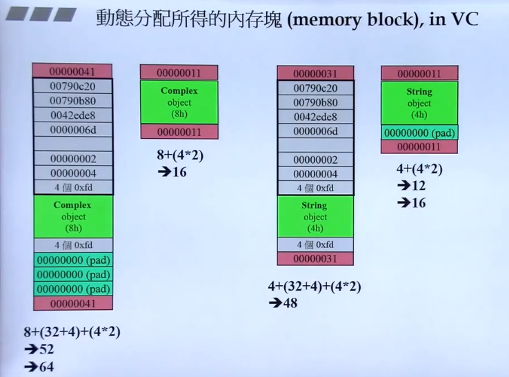
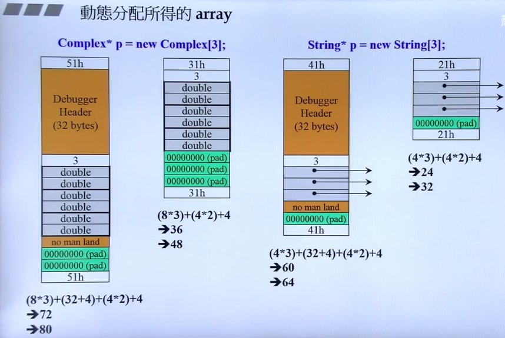
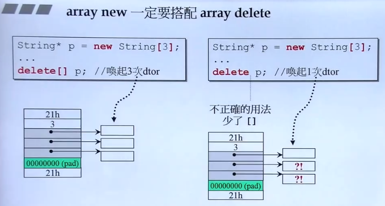
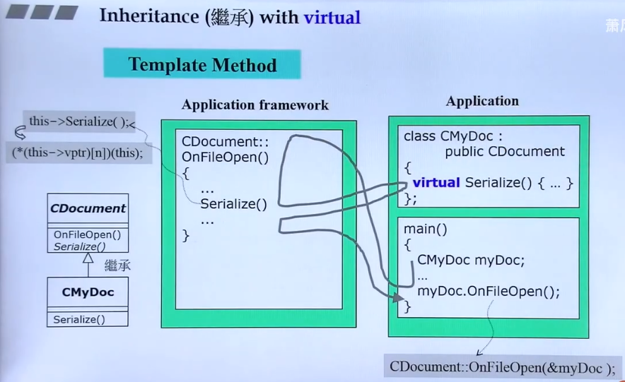
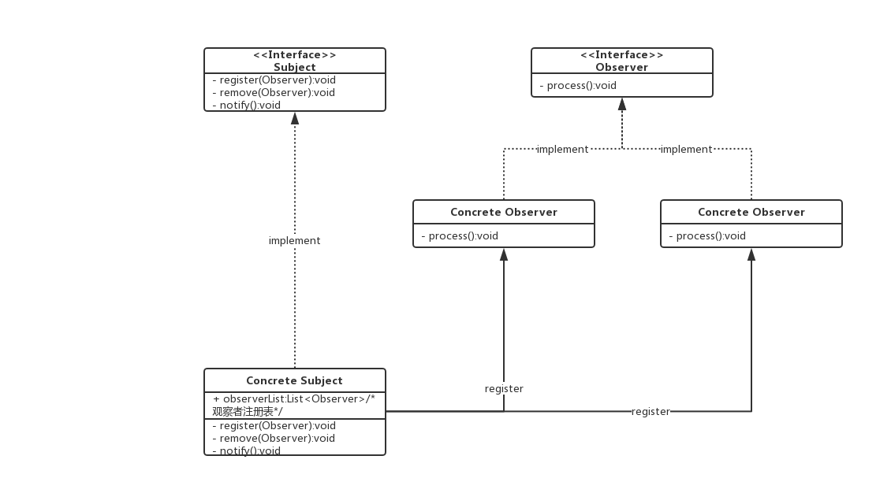
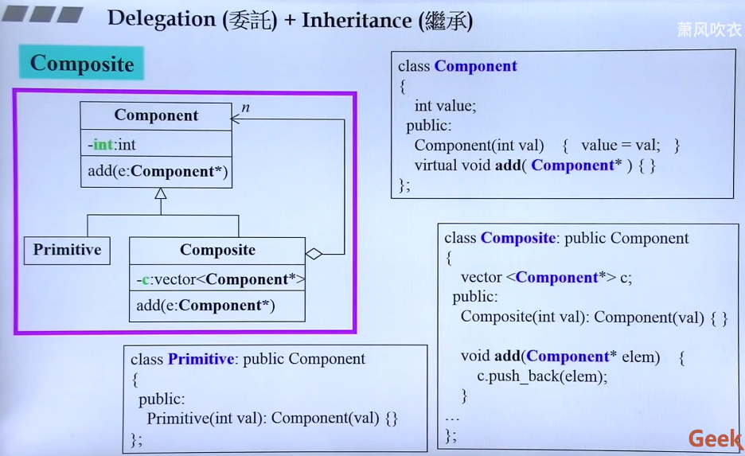
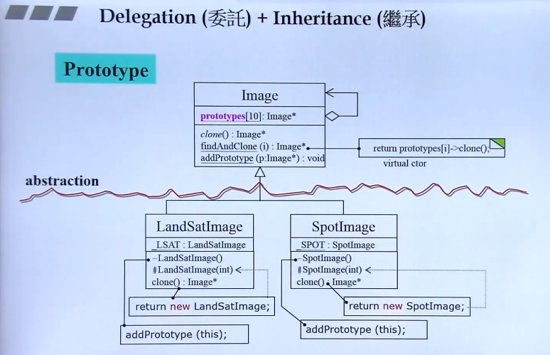

[TOC]

# 侯捷C++系列学习笔记

## 一  基础课：C++面向对象高级开发

C++版本：C++98(1.0)、03、11(2.0)、14、20

### 1 参数传递与返回值

#### 1.1 把构造函数写成private成员函数

```c++
class A{
    static A& getInstance();
    setup() {...}
private:
    A();
    A(const A& rhs);
    ....
    
}

A& A::getInstance()
{
    static A a;
    return a;
}

//只能通过
A::getInstance.setup();
```

这是单例设计模式，只能通过`A::getInstance.setup()`获得唯一的对象；

#### 1.2 传递const参数

对于传递参数，不会被函数内部改变的参数的应该被声明为const，const指针可以指向普通指针，但是普通指针无法指向const指针。

#### 1.3 传递引用reference

尽量传引用，不传value，如果不允许被修改，应该把引用声明为const；

传引用与传指针的区别，指针没有拷贝，引用有拷贝，在函数内部堆参数引用改变

#### 1.4 friend 友元

- 被声明为友元的函数可以直接取类内私有成员数据；友元打破了封装的特性；

- 相同class的各个object互为友元；

  比如不同的object的函数成员方法可以直接处理不同的object；

```
inline complex&
__doapl(complex* ths, const complex& r)
{
	ths->re += r.re; //第一参数被改变
    ths->im += r.im; //第二参数不被改变
    return *ths;
}
```

#### 1.5 return by reference

不可以返回局部变量local object的reference；

传递者不需要知道接收者是以reference形式接收

### 2 操作符重载

任何成员函数都有一个隐藏的this pointer，指向对象本身；

操作符重载有两种写法：成员函数写法、非成员函数写法；

#### 2.1 成员函数的操作符重载

重载操作符为什么需要返回对象的reference? **考虑多个操作符连用的情况；**多个操作符连用的时候，前面步骤完成的返回应该是对象reference，这样可以继续执行操作符，如果是void则不行；

`typename();`创建临时对象，用来return value；

临时对象声明执行完，下一行就消失了；

### 3 拷贝构造、拷贝赋值、析构

带指针的类，**必须**实现**拷贝构造**（深拷贝，new新的空间，将指针指向的内容拷贝过去）、**拷贝赋值**（重载 '=' 操作符，在赋值时候实现深拷贝，并且要判断是否自我赋值，作特殊处理）、**析构**（delete指针变量）

以带指针的class为例子：String Class

```c++
class String{
public:
    String(const char* cstr = 0);    //构造函数
    String(const String& str);       //拷贝构造（类带指针必须要写，传入参数是class类型）
    Stirng & operater=(const String& str);//拷贝赋值（类带指针必须要写）
    ~String();                            //析构 （类带指针必须要写）
    char* get_c_str() const{return m_data};
private:
    char* m_data; 
}

inline
String ::String(const char* cstr = 0)//标准写法
{
    if(cstr){ //指定初值
        m_data = new char[strlen(cstr)+1]; //字符串需要加上结束符‘\0’
        strcpy(m_data, cstr);
    }
    else{  //未指定初值
        m_data = new char[1];
        *m_data = '\0';
    }
}


inline
String::String(const String& str)//拷贝构造
{
    m_data = new char[ strlen(str.m_data) + 1 ] //深拷贝
    strcpy(m_data, str.m_data);
}

inline
Stirng& String::operater=(const String& str)//拷贝赋值
{
    if(this == &str) //重要，当发生自身赋值，避免自删，再赋值
        return *this;
    
    delete[] m_data; //删除自身
    m_data = new char[ strlen(str.m_data) + 1 ];//申请空间
    strcpy(m_data, str.m_data);//赋值
    return *this;
}

String::~String()
{
    delete[] m_data;
}

ostream& operator<<(ostream& os, const String& str)//要写成全局函数，而不是成员函数，因为成员函数，使用时候cout在右边，不符合使用习惯
{
    os << str.get_c_str();
    return os;
}

int main()
{
    test_copy();
    test_op();
    String s1("hello");
    cout<< s1;
}

void test_copy(void)
{
    String s1;         //调用构造函数
    String s2("hello");//调用构造函数
    
    String* p = new String("hello");
    delete p;
    //离开的时候一共调用三次析构函数
}//离开这个作用域范围前，必须手动释放指针(或者return).局部对象会自己消亡，但是指向对象的指针消失后，对象成为孤立状态

void test_op(void)
{
    String s1("hello ");//调用构造函数
    String s2(s1);//调用拷贝构造函数
    s2 = s1;      //调用拷贝赋值函数
}
```

### 4  Heap Stack Mannager

#### 4.1 new

先分配memory，在调用ctor

```c++
Complex* PC = new Complex(1,2);
//编译器转换为实际执行步骤：
1. void* mem = operater new( sizeof(Complex) ); //new内部调用的是malloc(n)
2. pc = static_cast<Complex*>(mem);             //指针类型转换
3. pc->Complex::Complex(1,2);                   //调用构造函数
```


#### 4.2 delete

先调用dtor，再释放memory

```c++
Complex* PC = new Complex(1,2);
.
.
.
delete pc;
//编译器转换为实际执行步骤：
1.Complex::~Complex(pc);//析构函数
2.operater delete(pc);  //释放内存，内部调用的是free(ps);
```


**free()是如何确定要释放的指针指向的内存空间大小？**

- case 1 分配内存块：



malloc分配的内存（字节对齐，这里是16字节对齐），在数据的头尾加上标志，表示数据块的大小，并且最地位1表示内存被分配；

灰色部分的信息是打开编译器debug选项才会存在，release模式下不会存在，绿色表示pad填充，为了字节对齐。

- case2 分配的是数组：



**为什么arry new要与delete [] 对应？**

new [] 和 delete []，new 和 delete的区别：



如果是指针数组，指针指向某类对象，当使用arry new申请内存空间，在调用的是delete [ ] 时候，编译器会认为需要对每个指针都调用析构函数，这样可以安全地释放掉所有对象；但是如果调用的是delete，编译器会认为需要对指针数组第一个成员调用一次析构，剩余的成员指针被直接删除，而其指向的对象没有掉用析构函数。

### 5 static

static变量既不是在堆也不是栈，而是在静态存储区；

- 静态static成员函数：

  只存在一份函数，与对象数量无关；

  非静态成员函数是根据this pointer来处理不同的对象，但是静态成员函数没有this pointer。

  只能处理静态数据；

  

- 静态static成员变量：

  只存在一份变量，与对象数量无关；

```c++
calss Account{
public:
	static double m_rate;
	static void set_rate(const double& x);
};
double Account::m_rate = 8.0; //class存在静态成员变量，只能通过这样的方式初始化变量

int main(){
	Account::set_rate(5.0);  //方式1：通过类名调用静态成员函数
	
	Account a;
	a.set_rate(7.0);         //方式2：通过对象调用静态成员函数，值得注意的是，静态成员函数被调用时不会有隐藏的this pointer
}
```

单例模式Singleton

一个class只能产生一个对象；

方式1 Singleton ：一开始就存在一个唯一的a对象

```c++
class A{
public:    
    static A& getInstance( return a; );
    setup() {...}
private:
    A();
    A(const A& rhs);
    static A a;          //只存在一个对象a
    ...
};

A::getInstance().setup();//调用的唯一接口
```

方式2  Meyers’ Singleton ：第一次被调用才会存在唯一的a对象 

```c++
class A{
public:    
    static A& getInstance();
    setup() {...}
private:
    A();
    A(const A& rhs);
    ...
};

A& A::getInstance()      //与方式1的差别
{
    static A a;          //当该函数被调用，才会存在a对象，且只有一个a
    return a;
}

```


### 6 类模板、函数模板

template <typename T>

template <class T>

### 7 组合、委托、继承

#### 7.1 Composition复合

class可以有不同的类型的class组合；

Composition(复合)关系下的构造和析构：

- 构造由内而外

  Container的构造函数首先调用Component的default构造函数，然后才执行自己；

  值得注意的是，编译器在没有明确定义该调用哪个Component的析构函数，编译器默认是调用default，编译器默认生成的析构函数；

  ```C++
  Container::Container(...): Component() {...};
  ```

- 析构由外而外

  Container的析构函数首先首先执行自己，然后调用Component的析构函数

#### 7.2 Delegation(委托) Compositon by reference

类内内部有指向别的类的指针，相比于Composition复合，委托更加灵活，被类内指针指向的对象可以灵活变化，但是不影响类本身。

例子：PIML(Private Inplementation OR Pointer to Implementation)，通过一个私有类成员指针，将指针所指向的类的内部实现实现、数据进行隐藏。

- 降低模块耦合；
- 降低编译依赖；
- 接口与实现分离，提高接口稳定性。

例子：reference counting

renferen同一个对象，实现共享，同时可以count被多少个对象共享；

对reference对象发生写操作，就复制一份数据，Copy on Write

#### 7.3 Inheritance(继承) is - a


base class的dtor（析构函数）必须是virtual，否则会出现undefined behavior；

保持良好的习惯：如果class将来会作为父类被继承，那么设计的时候，析构函数需要定义为virtual；

三种继承：public、protect、private

public最重要，**通过子类对象调用父类的函数**；

- **构造由内而外**

  Derived的构造函数首先调用Base的default构造函数，然后再执行自己；

- **析构由外而外**

  Derived的析构函数首先执行自己，然后再执行Base的析构函数；

#### 7.4 Inheritance(继承) with virtual function(虚函数)

- non-virtual 函数：不希望derived class重新定义(override)它；
- virtual函数：希望derived class重新定义(override)它，并且已经有默认定位；
- pure virtual函数：希望derived class一定要重新定义(override)它，它没有默认定义。

```c++
class Shape{
public:
    virtual void draw() const = 0;//pure virtual
    virtual void error(const std:;string& msg);//impure virtual
    int objectID()const;                       //non-virtual 
}
```

经典用法，延伸：

设计模式：Template Method 模板方法模式

父类中的虚函数由子类实现，框架固定，需要灵活改变的函数由子类定位；



为什么最终能调用derived class的Serialize函数？

因为this指针作为隐藏参数传入，编译器生成的实际函数是(*(this->ptr)\[n](this))，通过虚函数表找到derived class的Serialize函数。


#### 7.5 Inheritance继承 & Composition复合

调用构造函数和析构函数的顺序：

```c++
#include <iostream>

using namespace std;

class comp{
public:
    comp(){cout<<"call comp ctor!\n";};
    ~comp(){cout<<"call comp dtor!\n";};    
};


class base{
public:
    base(){cout<<"call base ctor!\n";};
    ~base(){cout<<"call base dtor!\n";};

private:
    comp comp1;
};

class derived:public base{
public:
    derived(){cout<<"call derived ctor!\n";};
    ~derived(){cout<<"call derived dtor!\n";}; 
};

int main(int agrc, char* argv[])
{
    derived d1;
    cout<<"end!\n";
    return 0;
}
```

```
执行结果：
call comp ctor!
call base ctor!
call derived ctor!
end!
call derived dtor!
call base dtor!
call comp dtor!
```


```c++
#include <iostream>

using namespace std;

class comp{
public:
    comp(){cout<<"call comp ctor!\n";};
    ~comp(){cout<<"call comp dtor!\n";};    
};


class base{
public:
    base(){cout<<"call base ctor!\n";};
    ~base(){cout<<"call base dtor!\n";};
};

class derived:public base{
public:
    derived(){cout<<"call derived ctor!\n";};
    ~derived(){cout<<"call derived dtor!\n";}; 

private:
    comp comp1;
};

int main(int agrc, char* argv[])
{
    derived d1;
    cout<<"end!\n";
    return 0;
}
```

```
执行结果：
call base ctor!
call comp ctor!
call derived ctor!
end!
call derived dtor!
call comp dtor!
call base dtor!
```


#### 7.6 Delegation委托 & Inheritance继承

- 解决的问题：一份数据，多种不同对象共享；
- 思路：Observer设计模式，定义一系列对象之间的一对多关系，当一个对象改变、更新状态时，依赖它的都会收到通知改变或者更新。

例子：数据只有一份，多个窗口(不同对象)以不同的形式把数据呈现出来；

```c++
class Subject{
    int m_value;
    vector<Observer *>m_views;
public:
    void attach(Observer* obs){
        m_views.push_back(obs);
    }
    
    void dettach(Oberver* obs){
        
    } 
    void set_val(int value){
        m_value = value;
        notify();
    }
    void notify(){
        for(int i = 0; i < m_views.size();++i){
            m_views[i]->update(this, m_value);
        }
    }
}

class Observer{
public:
   virtual void update(Subject* sub, int value); 
}
```



#### 7.7 Compsite设计模式

- 需要解决的问题：以文件系统为例子，目录可以放目录，也可以放文件；
- 思路：目录和文件有共同的父类，目录"容器"存放指针，既可以放下目录指针，也可以放下文件文件指针；

Composite设计模式又叫组合(组件)设计模式




#### 7.8 Prototype

需要解决的问题：父类需要创建未来出现的子类class对象

思路：设计接口，每一个子类创建一个实例存到父类的静态区



子类私有的构造函数，完成addPrototype，增加原型到父类；另一个构造函数完成clone；

## 二 C++对象模型

### 1 conversion function

### 2 pinter-like classes

#### 2.1 智能指针

> 智能指针主要用于管理在堆上分配的内存，它将普通的指针封装为一个栈对象。当栈对象的生存周期结束后，会在析构函数中释放掉申请的内存，从而防止内存泄漏。C++ 11中最常用的智能指针类型为**shared_ptr**,它采用引用计数的方法，记录当前内存资源被多少个智能指针引用。该引用计数的内存在堆上分配。当新增一个时引用计数加1，当过期时引用计数减一。只有引用计数为0时，智能指针才会自动释放引用的内存资源。对shared_ptr进行初始化时不能将一个普通指针直接赋值给智能指针，因为一个是指针，一个是类。可以通过make_shared函数或者通过构造函数传入普通指针。并可以通过get函数获得普通指针。

**为什么需要智能指针？**

> 智能指针的作用是管理一个指针，因为存在以下这种情况：申请的空间在函数结束时忘记释放，造成内存泄漏。使用智能指针可以很大程度上的避免这个问题，因为智能指针是一个类，当超出了类的实例对象的作用域时，会自动调用对象的析构函数，析构函数会自动释放资源。所以智能指针的作用原理就是在函数结束时自动释放内存空间，不需要手动释放内存空间。

C++的智能指针：auto_ptr (弃用), unique_ptr, shared_ptr, weak_ptr 其中后三个是C++11支持，并且第一个已经被C++11弃用。

理解智能指针的 * 和 -> ，以shared_ptr为例子

```c++
template<class T>
class shared_ptr
{
    public:
    T& operator*() const{return *px;}
    T* operator->() const{return px;}
    
    private:
    T* px;
    long* pn;
};

struct Foo
{
    ....
    void method(void)
}

//使用shared_ptr
shared_ptr<Foo> sp(new Foo); //定义shared_ptr指针
Foo f (*sp);                 //*解引用，得到对象
sp->method();                //->得到的是指向对象的指针，所以可以通过->调用对象的方法
//实际上等同于 px->method();
```


shared_ptr


#### 2.2 迭代器

迭代器也是一种智能指针，只是迭代器除了需要处理 * 和 ->，还要处理++和--等符号（指针移动，遍历容器）


理解：->操作符是为了得到对象指针然后调用对应的方法，*先是解引用，得到对象，然后&得到对象的指针。


#### 2.3 其他智能指针

##### auto_ptr

（C++98的方案，C++11已经抛弃）采用所有权模式。

cpp

```cpp
auto_ptr<string> p1 (new string ("I reigned lonely as a cloud.")); 
auto_ptr<string> p2; 
p2 = p1; //auto_ptr不会报错.
```

此时不会报错，p2剥夺了p1的所有权，但是当程序运行时访问p1将会报错。所以auto_ptr的缺点是：存在潜在的内存崩溃问题！

##### unique_ptr

（替换auto_ptr）unique_ptr实现独占式拥有或严格拥有概念，保证同一时间内只有一个智能指针可以指向该对象。它对于避免资源泄露(例如“以new创建对象后因为发生异常而忘记调用delete”)特别有用。

采用所有权模式，还是上面那个例子

cpp

```cpp
unique_ptr<string> p3 (new string ("auto"));   //#4
unique_ptr<string> p4；                       //#5
p4 = p3;//此时会报错！！
```

编译器认为p4=p3非法，避免了p3不再指向有效数据的问题。尝试复制p3时会编译期出错，而auto_ptr能通过编译期从而在运行期埋下出错的隐患。因此，unique_ptr比auto_ptr更安全。

另外unique_ptr还有更聪明的地方：当程序试图将一个 unique_ptr 赋值给另一个时，如果源 unique_ptr 是个临时右值，编译器允许这么做；如果源 unique_ptr 将存在一段时间，编译器将禁止这么做，比如：

cpp

```cpp
unique_ptr<string> pu1(new string ("hello world")); 
unique_ptr<string> pu2; 
pu2 = pu1;                                      // #1 不允许
unique_ptr<string> pu3; 
pu3 = unique_ptr<string>(new string ("You"));   // #2 允许
```

其中#1留下悬挂的unique_ptr(pu1)，这可能导致危害。而#2不会留下悬挂的unique_ptr，因为它调用 unique_ptr 的构造函数，该构造函数创建的临时对象在其所有权让给 pu3 后就会被销毁。这种随情况而已的行为表明，unique_ptr 优于允许两种赋值的auto_ptr 。

**注：**如果确实想执行类似与#1的操作，要安全的重用这种指针，可给它赋新值。C++有一个标准库函数std::move()，让你能够将一个unique_ptr赋给另一个。尽管转移所有权后 还是有可能出现原有指针调用（调用就崩溃）的情况。但是这个语法能强调你是在转移所有权，让你清晰的知道自己在做什么，从而不乱调用原有指针。

（**额外：**boost库的boost::scoped_ptr也是一个独占性智能指针，但是它不允许转移所有权，从始而终都只对一个资源负责，它更安全谨慎，但是应用的范围也更狭窄。）

例如：


```cpp
unique_ptr<string> ps1, ps2;
ps1 = demo("hello");
ps2 = move(ps1);
ps1 = demo("alexia");
cout << *ps2 << *ps1 << endl;
```

##### shared_ptr

shared_ptr实现共享式拥有概念。多个智能指针可以指向相同对象，该对象和其相关资源会在“最后一个引用被销毁”时候释放。从名字share就可以看出了资源可以被多个指针共享，它使用计数机制来表明资源被几个指针共享。可以通过成员函数use_count()来查看资源的所有者个数。除了可以通过new来构造，还可以通过传入auto_ptr, unique_ptr,weak_ptr来构造。当我们调用release()时，当前指针会释放资源所有权，计数减一。当计数等于0时，资源会被释放。

shared_ptr 是为了解决 auto_ptr 在对象所有权上的局限性(auto_ptr 是独占的), 在使用引用计数的机制上提供了可以共享所有权的智能指针。

成员函数：

use_count 返回引用计数的个数

unique 返回是否是独占所有权( use_count 为 1)

swap 交换两个 shared_ptr 对象(即交换所拥有的对象)

reset 放弃内部对象的所有权或拥有对象的变更, 会引起原有对象的引用计数的减少

get 返回内部对象(指针), 由于已经重载了()方法, 因此和直接使用对象是一样的.如


```cpp
shared_ptr<int> sp(new int(1)); 
```

sp 与 sp.get()是等价的。

share_ptr的简单例子：


```cpp
int main()
{
	string *s1 = new string("s1");

	shared_ptr<string> ps1(s1);
	shared_ptr<string> ps2;
	ps2 = ps1;

	cout << ps1.use_count()<<endl;	//2
	cout<<ps2.use_count()<<endl;	//2
	cout << ps1.unique()<<endl;	//0

	string *s3 = new string("s3");
	shared_ptr<string> ps3(s3);

	cout << (ps1.get()) << endl;	//033AEB48
	cout << ps3.get() << endl;	//033B2C50
	swap(ps1, ps3);	//交换所拥有的对象
	cout << (ps1.get())<<endl;	//033B2C50
	cout << ps3.get() << endl;	//033AEB48

	cout << ps1.use_count()<<endl;	//1
	cout << ps2.use_count() << endl;	//2
	ps2 = ps1;
	cout << ps1.use_count()<<endl;	//2
	cout << ps2.use_count() << endl;	//2
	ps1.reset();	//放弃ps1的拥有权，引用计数的减少
	cout << ps1.use_count()<<endl;	//0
	cout << ps2.use_count()<<endl;	//1
}
```

##### weak_ptr

share_ptr虽然已经很好用了，但是有一点share_ptr智能指针还是有内存泄露的情况，当两个对象相互使用一个shared_ptr成员变量指向对方，会造成循环引用，使引用计数失效，从而导致内存泄漏。

weak_ptr 是一种不控制对象生命周期的智能指针, 它指向一个 shared_ptr 管理的对象. 进行该对象的内存管理的是那个强引用的shared_ptr， weak_ptr只是提供了对管理对象的一个访问手段。weak_ptr 设计的目的是为配合 shared_ptr 而引入的一种智能指针来协助 shared_ptr 工作, 它只可以从一个 shared_ptr 或另一个 weak_ptr 对象构造, 它的构造和析构不会引起引用记数的增加或减少。weak_ptr是用来解决shared_ptr相互引用时的死锁问题,如果说两个shared_ptr相互引用,那么这两个指针的引用计数永远不可能下降为0,资源永远不会释放。它是对对象的一种弱引用，不会增加对象的引用计数，和shared_ptr之间可以相互转化，shared_ptr可以直接赋值给它，它可以通过调用lock函数来获得shared_ptr。


```cpp
class B;	//声明
class A
{
public:
	shared_ptr<B> pb_;
	~A()
	{
		cout << "A delete\n";
	}
};

class B
{
public:
	shared_ptr<A> pa_;
	~B()
	{
		cout << "B delete\n";
	}
};

void fun()
{
	shared_ptr<B> pb(new B());
	shared_ptr<A> pa(new A());
	cout << pb.use_count() << endl;	//1
	cout << pa.use_count() << endl;	//1
	pb->pa_ = pa;
	pa->pb_ = pb;
	cout << pb.use_count() << endl;	//2
	cout << pa.use_count() << endl;	//2
}

int main()
{
	fun();
	return 0;
}
```

可以看到fun函数中pa ，pb之间互相引用，两个资源的引用计数为2，当要跳出函数时，智能指针pa，pb析构时两个资源引用计数会减1，但是两者引用计数还是为1，导致跳出函数时资源没有被释放（A、B的析构函数没有被调用）运行结果没有输出析构函数的内容，造成内存泄露。如果把其中一个改为weak_ptr就可以了，我们把类A里面的shared_ptr pb_，改为weak_ptr pb_ ，运行结果如下：


```cpp
1
1
1
2
B delete
A delete
```

这样的话，资源B的引用开始就只有1，当pb析构时，B的计数变为0，B得到释放，B释放的同时也会使A的计数减1，同时pa析构时使A的计数减1，那么A的计数为0，A得到释放。

注意：我们不能通过weak_ptr直接访问对象的方法，比如B对象中有一个方法print()，我们不能这样访问，pa->pb_->print()，因为pb_是一个weak_ptr，应该先把它转化为shared_ptr，如：


```cpp
shared_ptr<B> p = pa->pb_.lock();
p->print();
```

weak_ptr 没有重载*和->但可以使用 lock 获得一个可用的 shared_ptr 对象. 注意, weak_ptr 在使用前需要检查合法性.

expired 用于检测所管理的对象是否已经释放, 如果已经释放, 返回 true; 否则返回 false.

lock 用于获取所管理的对象的强引用(shared_ptr). 如果 expired 为 true, 返回一个空的 shared_ptr; 否则返回一个 shared_ptr, 其内部对象指向与 weak_ptr 相同.

use_count 返回与 shared_ptr 共享的对象的引用计数.

reset 将 weak_ptr 置空.

weak_ptr 支持拷贝或赋值, 但不会影响对应的 shared_ptr 内部对象的计数.

##### share_ptr和weak_ptr的核心实现

weakptr的作为弱引用指针，其实现依赖于counter的计数器类和share_ptr的赋值，构造，所以先把counter和share_ptr简单实现

##### Counter简单实现


```cpp
class Counter
{
public:
    Counter() : s(0), w(0){};
    int s;	//share_ptr的引用计数
    int w;	//weak_ptr的引用计数
};
```

counter对象的目地就是用来申请一个块内存来存引用基数，s是share_ptr的引用计数，w是weak_ptr的引用计数，当w为0时，删除Counter对象。

##### share_ptr的简单实现


```cpp
template <class T>
class WeakPtr; //为了用weak_ptr的lock()，来生成share_ptr用，需要拷贝构造用

template <class T>
class SharePtr
{
public:
    SharePtr(T *p = 0) : _ptr(p)
    {
        cnt = new Counter();
        if (p)
            cnt->s = 1;
        cout << "in construct " << cnt->s << endl;
    }
    ~SharePtr()
    {
        release();
    }

    SharePtr(SharePtr<T> const &s)
    {
        cout << "in copy con" << endl;
        _ptr = s._ptr;
        (s.cnt)->s++;
        cout << "copy construct" << (s.cnt)->s << endl;
        cnt = s.cnt;
    }
    SharePtr(WeakPtr<T> const &w) //为了用weak_ptr的lock()，来生成share_ptr用，需要拷贝构造用
    {
        cout << "in w copy con " << endl;
        _ptr = w._ptr;
        (w.cnt)->s++;
        cout << "copy w  construct" << (w.cnt)->s << endl;
        cnt = w.cnt;
    }
    SharePtr<T> &operator=(SharePtr<T> &s)
    {
        if (this != &s)
        {
            release();
            (s.cnt)->s++;
            cout << "assign construct " << (s.cnt)->s << endl;
            cnt = s.cnt;
            _ptr = s._ptr;
        }
        return *this;
    }
    T &operator*()
    {
        return *_ptr;
    }
    T *operator->()
    {
        return _ptr;
    }
    friend class WeakPtr<T>; //方便weak_ptr与share_ptr设置引用计数和赋值

protected:
    void release()
    {
        cnt->s--;
        cout << "release " << cnt->s << endl;
        if (cnt->s < 1)
        {
            delete _ptr;
            if (cnt->w < 1)
            {
                delete cnt;
                cnt = NULL;
            }
        }
    }

private:
    T *_ptr;
    Counter *cnt;
};
```

share_ptr的给出的函数接口为：构造，拷贝构造，赋值，解引用，通过release来在引用计数为0的时候删除_ptr和cnt的内存。

##### weak_ptr简单实现


```cpp
template <class T>
class WeakPtr
{
public: //给出默认构造和拷贝构造，其中拷贝构造不能有从原始指针进行构造
    WeakPtr()
    {
        _ptr = 0;
        cnt = 0;
    }
    WeakPtr(SharePtr<T> &s) : _ptr(s._ptr), cnt(s.cnt)
    {
        cout << "w con s" << endl;
        cnt->w++;
    }
    WeakPtr(WeakPtr<T> &w) : _ptr(w._ptr), cnt(w.cnt)
    {
        cnt->w++;
    }
    ~WeakPtr()
    {
        release();
    }
    WeakPtr<T> &operator=(WeakPtr<T> &w)
    {
        if (this != &w)
        {
            release();
            cnt = w.cnt;
            cnt->w++;
            _ptr = w._ptr;
        }
        return *this;
    }
    WeakPtr<T> &operator=(SharePtr<T> &s)
    {
        cout << "w = s" << endl;
        release();
        cnt = s.cnt;
        cnt->w++;
        _ptr = s._ptr;
        return *this;
    }
    SharePtr<T> lock()
    {
        return SharePtr<T>(*this);
    }
    bool expired()
    {
        if (cnt)
        {
            if (cnt->s > 0)
            {
                cout << "empty" << cnt->s << endl;
                return false;
            }
        }
        return true;
    }
    friend class SharePtr<T>; //方便weak_ptr与share_ptr设置引用计数和赋值
    
protected:
    void release()
    {
        if (cnt)
        {
            cnt->w--;
            cout << "weakptr release" << cnt->w << endl;
            if (cnt->w < 1 && cnt->s < 1)
            {
                //delete cnt;
                cnt = NULL;
            }
        }
    }

private:
    T *_ptr;
    Counter *cnt;
};
```

weak_ptr一般通过share_ptr来构造，通过expired函数检查原始指针是否为空，lock来转化为share_ptr。


#### 3 function- like classes 仿函数

##### 


## 三 C++内存管理


## 四 STL源码剖析


## 五 C++STL与泛型编程


## 六 C++11新特性

## 七 C++20新特性