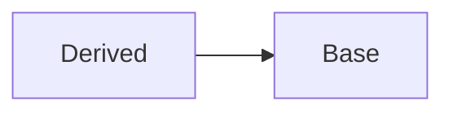

[TOC]

# 侯捷C++系列学习笔记

## 基础课：C++面向对象高级开发

C++版本：C++98(1.0)、03、11(2.0)、14、20

### 1 参数传递与返回值

#### 1.1 把构造函数写成private成员函数

```c++
class A{
    static A& getInstance();
    setup() {...}
private:
    A();
    A(const A& rhs);
    ....
    
}

A& A::getInstance()
{
    static A a;
    return a;
}

//只能通过
A::getInstance.setup();
```

这是单例设计模式，只能通过`A::getInstance.setup()`获得唯一的对象；

#### 1.2 传递const参数

对于传递参数，不会被函数内部改变的参数的应该被声明为const，const指针可以指向普通指针，但是普通指针无法指向const指针。

#### 1.3 传递引用reference

尽量传引用，不传value，如果不允许被修改，应该把引用声明为const；

传引用与传指针的区别，指针没有拷贝，引用有拷贝，在函数内部堆参数引用改变

#### 1.4 friend 友元

- 被声明为友元的函数可以直接取类内私有成员数据；友元打破了封装的特性；

- 相同class的各个object互为友元；

  比如不同的object的函数成员方法可以直接处理不同的object；

```
inline complex&
__doapl(complex* ths, const complex& r)
{
	ths->re += r.re; //第一参数被改变
    ths->im += r.im; //第二参数不被改变
    return *ths;
}
```

#### 1.5 return by reference

不可以返回局部变量local object的reference；

传递者不需要知道接收者是以reference形式接收

### 2 操作符重载

任何成员函数都有一个隐藏的this pointer，指向对象本身；

操作符重载有两种写法：成员函数写法、非成员函数写法；

#### 2.1 成员函数的操作符重载

重载操作符为什么需要返回对象的reference? **考虑多个操作符连用的情况；**多个操作符连用的时候，前面步骤完成的返回应该是对象reference，这样可以继续执行操作符，如果是void则不行；

`typename();`创建临时对象，用来return value；

临时对象声明执行完，下一行就消失了；

### 3 拷贝构造、拷贝赋值、析构

带指针的类，**必须**实现**拷贝构造**（深拷贝，new新的空间，将指针指向的内容拷贝过去）、**拷贝赋值**（重载 '=' 操作符，在赋值时候实现深拷贝，并且要判断是否自我赋值，作特殊处理）、**析构**（delete指针变量）

以带指针的class为例子：String Class

```c++
class String{
public:
    String(const char* cstr = 0);    //构造函数
    String(const String& str);       //拷贝构造（类带指针必须要写，传入参数是class类型）
    Stirng & operater=(const String& str);//拷贝赋值（类带指针必须要写）
    ~String();                            //析构 （类带指针必须要写）
    char* get_c_str() const{return m_data};
private:
    char* m_data; 
}

inline
String ::String(const char* cstr = 0)//标准写法
{
    if(cstr){ //指定初值
        m_data = new char[strlen(cstr)+1]; //字符串需要加上结束符‘\0’
        strcpy(m_data, cstr);
    }
    else{  //未指定初值
        m_data = new char[1];
        *m_data = '\0';
    }
}


inline
String::String(const String& str)//拷贝构造
{
    m_data = new char[ strlen(str.m_data) + 1 ] //深拷贝
    strcpy(m_data, str.m_data);
}

inline
Stirng& String::operater=(const String& str)//拷贝赋值
{
    if(this == &str) //重要，当发生自身赋值，避免自删，再赋值
        return *this;
    
    delete[] m_data; //删除自身
    m_data = new char[ strlen(str.m_data) + 1 ];//申请空间
    strcpy(m_data, str.m_data);//赋值
    return *this;
}

String::~String()
{
    delete[] m_data;
}

ostream& operator<<(ostream& os, const String& str)//要写成全局函数，而不是成员函数，因为成员函数，使用时候cout在右边，不符合使用习惯
{
    os << str.get_c_str();
    return os;
}

int main()
{
    test_copy();
    test_op();
    String s1("hello");
    cout<< s1;
}

void test_copy(void)
{
    String s1;         //调用构造函数
    String s2("hello");//调用构造函数
    
    String* p = new String("hello");
    delete p;
    //离开的时候一共调用三次析构函数
}//离开这个作用域范围前，必须手动释放指针(或者return).局部对象会自己消亡，但是指向对象的指针消失后，对象成为孤立状态

void test_op(void)
{
    String s1("hello ");//调用构造函数
    String s2(s1);//调用拷贝构造函数
    s2 = s1;      //调用拷贝赋值函数
}
```

### 4  Heap Stack Mannager

#### 4.1 new

先分配memory，在调用ctor

```c++
Complex* PC = new Complex(1,2);
//编译器转换为实际执行步骤：
1. void* mem = operater new( sizeof(Complex) ); //new内部调用的是malloc(n)
2. pc = static_cast<Complex*>(mem);             //指针类型转换
3. pc->Complex::Complex(1,2);                   //调用构造函数
```


#### 4.2 delete

先调用dtor，再释放memory

```c++
Complex* PC = new Complex(1,2);
.
.
.
delete pc;
//编译器转换为实际执行步骤：
1.Complex::~Complex(pc);//析构函数
2.operater delete(pc);  //释放内存，内部调用的是free(ps);
```


**free()是如何确定要释放的指针指向的内存空间大小？**

- case 1 分配内存块：


malloc分配的内存（字节对齐，这里是16字节对齐），在数据的头尾加上标志，表示数据块的大小，并且最地位1表示内存被分配；

灰色部分的信息是打开编译器debug选项才会存在，release模式下不会存在，绿色表示pad填充，为了字节对齐。

- case2 分配的是数组：


**为什么arry new要与delete [] 对应？**

new [] 和 delete []，new 和 delete的区别：


如果是指针数组，指针指向某类对象，当使用arry new申请内存空间，在调用的是delete [ ] 时候，编译器会认为需要对每个指针都调用析构函数，这样可以安全地释放掉所有对象；但是如果调用的是delete，编译器会认为需要对指针数组第一个成员调用一次析构，剩余的成员指针被直接删除，而其指向的对象没有掉用析构函数。

### 5 static

static变量既不是在堆也不是栈，而是在静态存储区；

- 静态static成员函数：

  只存在一份函数，与对象数量无关；

  非静态成员函数是根据this pointer来处理不同的对象，但是静态成员函数没有this pointer。

  只能处理静态数据；

  

- 静态static成员变量：

  只存在一份变量，与对象数量无关；

```c++
calss Account{
public:
	static double m_rate;
	static void set_rate(const double& x);
};
double Account::m_rate = 8.0; //class存在静态成员变量，只能通过这样的方式初始化变量

int main(){
	Account::set_rate(5.0);  //方式1：通过类名调用静态成员函数
	
	Account a;
	a.set_rate(7.0);         //方式2：通过对象调用静态成员函数，值得注意的是，静态成员函数被调用时不会有隐藏的this pointer
}
```

单例模式Singleton

一个class只能产生一个对象；

方式1 Singleton ：一开始就存在一个唯一的a对象

```c++
class A{
public:    
    static A& getInstance( return a; );
    setup() {...}
private:
    A();
    A(const A& rhs);
    static A a;          //只存在一个对象a
    ...
};

A::getInstance().setup();//调用的唯一接口
```

方式2  Meyers’ Singleton ：第一次被调用才会存在唯一的a对象 

```c++
class A{
public:    
    static A& getInstance();
    setup() {...}
private:
    A();
    A(const A& rhs);
    ...
};

A& A::getInstance()      //与方式1的差别
{
    static A a;          //当该函数被调用，才会存在a对象，且只有一个a
    return a;
}

```


### 6 类模板、函数模板

template <typename T>

template <class T>

### 7 组合、委托、继承

#### 7.1 Composition复合

class可以有不同的类型的class组合；

Composition(复合)关系下的构造和析构：

- 构造由内而外

  Container的构造函数首先调用Component的default构造函数，然后才执行自己；

  值得注意的是，编译器在没有明确定义该调用哪个Component的析构函数，编译器默认是调用default，编译器默认生成的析构函数；

  ```C++
  Container::Container(...): Component() {...};
  ```

- 析构由外而外

  Container的析构函数首先首先执行自己，然后调用Component的析构函数

#### 7.2 Delegation(委托) Compositon by reference

类内内部有指向别的类的指针，相比于Composition复合，委托更加灵活，被类内指针指向的对象可以灵活变化，但是不影响类本身。

例子：PIML(Private Inplementation OR Pointer to Implementation)，通过一个私有类成员指针，将指针所指向的类的内部实现实现、数据进行隐藏。

- 降低模块耦合；
- 降低编译依赖；
- 接口与实现分离，提高接口稳定性。

例子：reference counting

renferen同一个对象，实现共享，同时可以count被多少个对象共享；

对reference对象发生写操作，就复制一份数据，Copy on Write

#### 7.3 Inheritance(继承) is - a



base class的dtor（析构函数）必须是virtual，否则会出现undefined behavior；

保持良好的习惯：如果class将来会作为父类被继承，那么设计的时候，析构函数需要定义为virtual；

三种继承：public、protect、private

public最重要，**通过子类对象调用父类的函数**；

- **构造由内而外**

  Derived的构造函数首先调用Base的default构造函数，然后再执行自己；

- **析构由外而外**

  Derived的析构函数首先执行自己，然后再执行Base的析构函数；

#### 7.4 Inheritance(继承) with virtual function(虚函数)

- non-virtual 函数：不希望derived class重新定义(override)它；
- virtual函数：希望derived class重新定义(override)它，并且已经有默认定位；
- pure virtual函数：希望derived class一定要重新定义(override)它，它没有默认定义。

```c++
class Shape{
public:
    virtual void draw() const = 0;//pure virtual
    virtual void error(const std:;string& msg);//impure virtual
    int objectID()const;                       //non-virtual 
}
```

经典用法，延伸：

设计模式：Template Method 模板方法模式

父类中的虚函数由子类实现，框架固定，需要灵活改变的函数由子类定位；


为什么最终能调用derived class的Serialize函数？

因为this指针作为隐藏参数传入，编译器生成的实际函数是(*(this->ptr)\[n](this))，通过虚函数表找到derived class的Serialize函数。


#### 7.5 Inheritance继承 & Composition复合

调用构造函数和析构函数的顺序：

```c++
#include <iostream>

using namespace std;

class comp{
public:
    comp(){cout<<"call comp ctor!\n";};
    ~comp(){cout<<"call comp dtor!\n";};    
};


class base{
public:
    base(){cout<<"call base ctor!\n";};
    ~base(){cout<<"call base dtor!\n";};

private:
    comp comp1;
};

class derived:public base{
public:
    derived(){cout<<"call derived ctor!\n";};
    ~derived(){cout<<"call derived dtor!\n";}; 
};

int main(int agrc, char* argv[])
{
    derived d1;
    cout<<"end!\n";
    return 0;
}
```

```
执行结果：
call comp ctor!
call base ctor!
call derived ctor!
end!
call derived dtor!
call base dtor!
call comp dtor!
```


```c++
#include <iostream>

using namespace std;

class comp{
public:
    comp(){cout<<"call comp ctor!\n";};
    ~comp(){cout<<"call comp dtor!\n";};    
};


class base{
public:
    base(){cout<<"call base ctor!\n";};
    ~base(){cout<<"call base dtor!\n";};
};

class derived:public base{
public:
    derived(){cout<<"call derived ctor!\n";};
    ~derived(){cout<<"call derived dtor!\n";}; 

private:
    comp comp1;
};

int main(int agrc, char* argv[])
{
    derived d1;
    cout<<"end!\n";
    return 0;
}
```

```
执行结果：
call base ctor!
call comp ctor!
call derived ctor!
end!
call derived dtor!
call comp dtor!
call base dtor!
```


#### 7.6 Delegation委托 & Inheritance继承

- 解决的问题：一份数据，多种不同对象共享；
- 思路：Observer设计模式，定义一系列对象之间的一对多关系，当一个对象改变、更新状态时，依赖它的都会收到通知改变或者更新。

例子：数据只有一份，多个窗口(不同对象)以不同的形式把数据呈现出来；

```c++
class Subject{
    int m_value;
    vector<Observer *>m_views;
public:
    void attach(Observer* obs){
        m_views.push_back(obs);
    }
    
    void dettach(Oberver* obs){
        
    } 
    void set_val(int value){
        m_value = value;
        notify();
    }
    void notify(){
        for(int i = 0; i < m_views.size();++i){
            m_views[i]->update(this, m_value);
        }
    }
}

class Observer{
public:
   virtual void update(Subject* sub, int value); 
}
```


#### 7.7 Compsite设计模式

- 需要解决的问题：以文件系统为例子，目录可以放目录，也可以放文件；
- 思路：目录和文件有共同的父类，目录"容器"存放指针，既可以放下目录指针，也可以放下文件文件指针；

Composite设计模式又叫组合(组件)设计模式


#### 7.8 Prototype

需要解决的问题：父类需要创建未来出现的子类class对象

思路：设计接口，每一个子类创建一个实例存到父类的静态区


子类私有的构造函数，完成addPrototype，增加原型到父类；另一个构造函数完成clone；

## C++对象模型


## C++内存管理


## STL源码剖析


## C++STL与泛型编程


## C++11新特性

