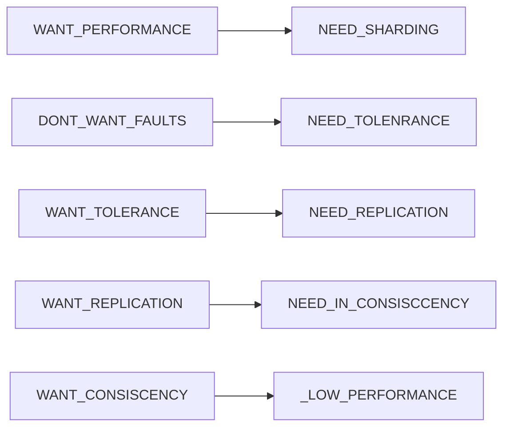
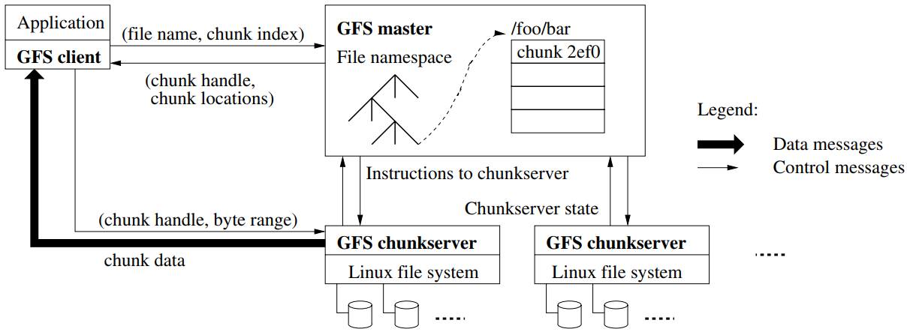

## MIT 6.824分布式系统

[TOC]

### 重要概念：

- **MapReduce:**  MapReduce 编程模型。总的来讲，Google MapReduce 所执行的分布式计算会以一组键值对作为输入，输出另一组键值对，用户则通过编写 Map 函数和 Reduce 函数来指定所要进行的计算；

  使用函数式编程模型的好处在于这种编程模型本身就对并行执行有良好的支持，这使得底层系统能够轻易地将大数据量的计算并行化，同时由用户函数所提供的确定性也使得底层系统能够将函数重新执行作为提供容错性的主要手段；

- **GFS:** 谷歌分布式**文件**系统，容错分布式存储；
- **Primary-Backup Replication:** 主从备份，指得是备份“计算”，实现可容错服务器的一种常用方案；
- **Raft:**  一种分布式共识算法，在 Replicated State Machine 中，分布式共识算法的职责就是按照固定的顺序将指定的日志内容备份到集群的其他实例上。

### Lecure 1 MapReudce

### Lecure 2 RPC and Threads

RPC ( Remote Procedure Call ): 远程过程调用，简单的理解就是，一个节点请求另一个节点提供服务

Cordination

这节课的总结：

### Lecure 3 GFS

#### 3.1  GFS Target:

- Big, Fast
- Global, Universal
- Sharding
- Automatic Rcovering

#### 3.2 Paper: *The Google File System* 

Topic：谷歌分布式文件系统

##### 3.2.1 GFS设计原则：

- 节点失效是常态
- 存储内容以大文件为主

##### 3.2.2 GFS集群架构：

##### 3.2.3 chunk大小：

##### 3.2.4 GFS元数据管理：

GFS元数据主要包括的信息：

- 文件和Chunk的命名空间
- 文件与Chunk的映射
- Chunk Replica的位置信息

元数据保存在Master内存中使得Master要对元数据作出变更变得极为容易；同时，这也使得Master可以简单高效地周期性扫描整个集群的状态，以实现Chunk回收、迁移、均衡等操作。唯一的不足在于这使得整个集群所能拥有的Chunk数量受限于Master的内存大小，然而实际中不必担心这种情况，因为一个64MB的Chunk，只需要保存64KB的元数据，况且提高Master内存容量的成本也很低。

Master会把前两类信息以日志形式持久化存储在Master的本地磁盘上，并在在其他机器上备份，但是不会持久化保存Chunk Replica的位置信息，而是在集群启动时由Master询问各个Chunk Server其当前所有的Repica。这样做可以省去由于Chunk Server离开集群、更改名字、重启等原因的Master与Chunk Server的同步问题。此后，Master通过心跳包来监控Chunk Server的状态并更新内存中的信息。

为了保证元数据的可用性，Master在对元数据做任何操作前对会用先写日志的形式将操作进行记录，只有当日志写入完成后才会响应客户端的请求，而这些日志也会备份到多个机器上。日志不仅是元数据的唯一持久化记录，也是定义操作执行顺序的时间线。文件、Chunk和他们的版本信息都由他们的创建时间唯一的永久的标识。

##### 3.2.5 Namespace管理：

##### 3.2.6 Chunk租约lease和变更顺序：

##### 3.2.7 GFS集群常见操作流程：

###### 3.2.7.1 文件写入：

###### 3.2.7.2文件追加：

###### 3.2.7.3 文件快照：

###### 3.2.7.4 文件读取：

#### 3.3 这节课的总结

### Lecure 4 Primary-Backup Replication

阅读《The Design of a Practical System for Fault-Tolerant Virtual Machines》这篇论文主要讲述了 VMware 公司如何利用一种协议来实现两个虚拟机之间的主从备份（Primary-Backup Replication）。

#### 4.1 背景：

为了实现容错服务器，主从备份是常用的方案：备份服务器需要在几乎任何时候保持与服务器保持一致，当主服务器失效后，备份服务器能马上接管，两种主要方式：

- **State Transfer 状态转移：**主服务器所有状态变化传输给备用服务器；方案简单，数据传输量大
- **Replication State Machine 备份状态机：**将需要备份的服务器视为一个确定性状态机--主备以相同方式启动，导入相同的输入，进入相同的状态、给出相同的输出；方案复杂，但是传输数据量小。

VMware 选用了状态机方法，因为对于虚拟机而言，其状态过于复杂，使用状态转移方法也不会简单多少。在虚拟机上应用备份状态机方法也会有一定的顾虑 —— 我们难以保证在虚拟机上运行的应用（即操作系统）是确定性的。实际上，在物理机上应用状态机方法是极其困难的，其所能接收到的输入很多都是不确定的（如定时器中断等），但虚拟机是运行在 Hypervisor（虚拟机管理程序）之上的抽象机器，通过 Hypervisor 这一隔离层便能很好地将非确定性的输入转变为确定性的输入（这种将非确定转为确定的思路在数据库中也很常见，参考 MongoDB oplog）。

#### FAQ

> Q: Both GFS and VMware FT provide fault tolerance. How should we think about when one or the other is better?
>
> Q：GFS 和 VMware FT 都提供了容错性。我们该怎么比较它们呢？

FT 备份的是**计算**，你能用它为任何已有的网络服务器提供容错性。FT 提供了相当严谨的一致性而且对客户端和服务器都是透明的。例如，你可以将 FT 应用于一个已有的邮件服务器并为其提供容错性。

相比之下，GFS 只为**存储**提供容错性。因为 GFS 只针对一种简单的服务提供容错性，它的备份策略会比 FT 更为高效：例如，GFS 不需要让所有的中断都以相同的顺序应用在所有的 Replica 上。GFS 通常只会被用作一个对外提供完整容错服务的系统的一部分：例如，VMware FT 本身也依赖了一个在主备虚拟机间共享的有容错性的存储服务，而你则可以用类似于 GFS 的东西来实现这个模块（虽然从细节上来讲 GFS 不太适用于 FT）。

> Q: What is “an atomic test-and-set operation on the shared storage”?
>
> Q：论文中提到的“对共享存储的原子 test-and-set 操作”是什么？

意思就是说一个计算机可以在一个原子的操作中读取并且写入指定的磁盘块。如果两个计算机都调用了这个操作，那么两组读写操作不会交织在一起，而是其中一个计算机的读写操作会在另一个计算机的读写操作完成后再执行。

> Q: What happens if the primary fails just after it sends output to the external world?
>
> Q：如果主虚拟机在向外界进行输出后立刻就失效了会怎么样？

这个输出可能会执行两次：主虚拟机一次，备份虚拟机一次。对于网络和磁盘 IO 来说，这个重复不会产生任何问题。如果输出的是一个网络包，那么接收端的 TCP 栈会丢弃掉这个重复的包；如果是磁盘 IO，那么磁盘 IO 实际上是幂等的（两次操作会在同一个位置写入相同的数据，这之间也不会有其他的 IO）。

> Q: Is it reasonable to address only the fail-stop failures? What are other type of failures?
>
> Q：只去解决宕机失效的场景是合理的吗？还存在其他类型的失效吗？

这是合理的，因为现实世界中的多数失效本质上来讲都是宕机失效，例如各种网络失效和电源失效。要做到更好的话就需要处理那些似乎正在正常运行但其实正在产生错误结果的计算机 —— 在最坏的情况下，这样的失效可能是来源于一个恶意的攻击者。这类非宕机失效的失效通常被称为“拜占庭”（Byzantine）。我们实际上是有方法去应对拜占庭失效的，我们会在这节课的末尾学习这些方法，但 6.824 的主要内容还是关于宕机失效。

### Lecure 5 Go threads and Raft

Raft 分布式共识算法，在 Replicated State Machine 中，分布式共识算法的职责就是按照固定的顺序将指定的日志内容备份到集群的其他实例上。

### Lecure 6 Fault Tolerance Raft Part1

### Lecure 7 Fault Tolerance Raft Part2 

### Lecure 8 Zookeeper

### Lecure 9 More Replication CRAQ

### Lecure 10 Cloud Replication DB Aurora

### Lecure 11 Cache Consistency Frangipani

### Lecure 12  Distributed  Transaction

### Lecure 13 Spanner

### Lecure 14 Optimistic Concurrecny Control

### Lecure 15 Big Data Spark

### Lecure 16 Cache Consistence Memcached at Facebook

### Lecure 17 COPS Causal Consistency

### Lecure 18 Fork Consistency Certificate Transparency

### Lecure 19 Bitcoin

### Lecure 20 BlockStack