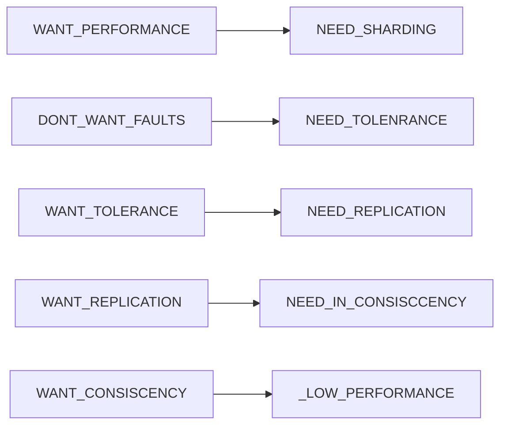
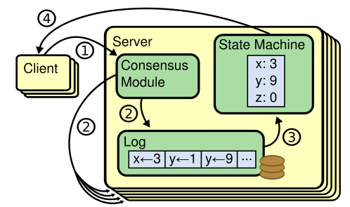
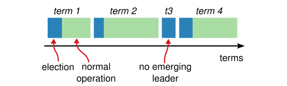
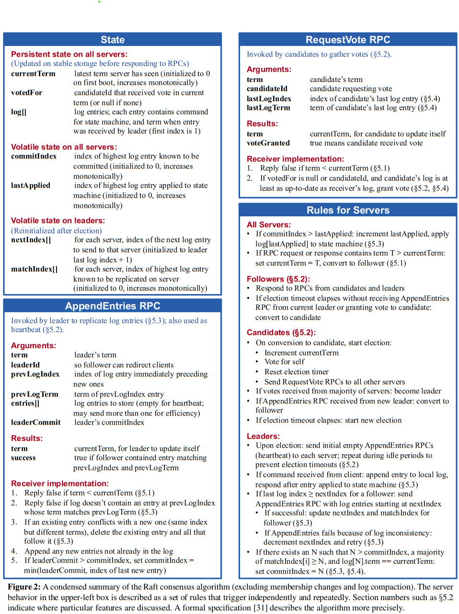
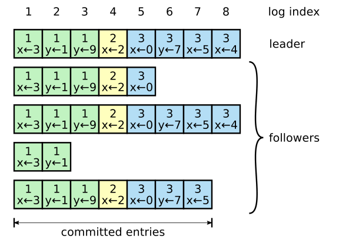
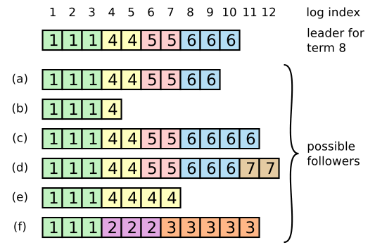

## MIT 6.824分布式系统

[TOC]

### 重要概念：

- **MapReduce:**  MapReduce 编程模型。总的来讲，Google MapReduce 所执行的分布式计算会以一组键值对作为输入，输出另一组键值对，用户则通过编写 Map 函数和 Reduce 函数来指定所要进行的计算；

  使用函数式编程模型的好处在于这种编程模型本身就对并行执行有良好的支持，这使得底层系统能够轻易地将大数据量的计算并行化，同时由用户函数所提供的确定性也使得底层系统能够将函数重新执行作为提供容错性的主要手段；

- **GFS:** 谷歌分布式**文件**系统，容错分布式存储；
- **Primary-Backup Replication:** 主从备份，指得是备份“计算”，实现可容错服务器的一种常用方案；
- **Raft:**  一种分布式共识算法，在 Replicated State Machine 中，分布式共识算法的职责就是按照固定的顺序将指定的日志内容备份到集群的其他实例上。

### Lecure 1 MapReudce


### Lecure 2 RPC and Threads

RPC ( Remote Procedure Call ): 远程过程调用，简单的理解就是，一个节点请求另一个节点提供服务

Cordination

这节课的总结：


### Lecure 3 GFS



#### 3.1  GFS Target:

- Big, Fast
- Global, Universal
- Sharding
- Automatic Rcovering


#### 3.2 Paper: *The Google File System* 

Topic：谷歌分布式文件系统

##### 3.2.1 GFS设计原则：

- 节点失效是常态
- 存储内容以大文件为主

##### 3.2.2 GFS集群架构：


##### 3.2.3 chunk大小：

##### 3.2.4 GFS元数据管理：

GFS元数据主要包括的信息：

- 文件和Chunk的命名空间
- 文件与Chunk的映射
- Chunk Replica的位置信息

元数据保存在Master内存中使得Master要对元数据作出变更变得极为容易；同时，这也使得Master可以简单高效地周期性扫描整个集群的状态，以实现Chunk回收、迁移、均衡等操作。唯一的不足在于这使得整个集群所能拥有的Chunk数量受限于Master的内存大小，然而实际中不必担心这种情况，因为一个64MB的Chunk，只需要保存64KB的元数据，况且提高Master内存容量的成本也很低。

Master会把前两类信息以日志形式持久化存储在Master的本地磁盘上，并在在其他机器上备份，但是不会持久化保存Chunk Replica的位置信息，而是在集群启动时由Master询问各个Chunk Server其当前所有的Repica。这样做可以省去由于Chunk Server离开集群、更改名字、重启等原因的Master与Chunk Server的同步问题。此后，Master通过心跳包来监控Chunk Server的状态并更新内存中的信息。

为了保证元数据的可用性，Master在对元数据做任何操作前对会用先写日志的形式将操作进行记录，只有当日志写入完成后才会响应客户端的请求，而这些日志也会备份到多个机器上。日志不仅是元数据的唯一持久化记录，也是定义操作执行顺序的时间线。文件、Chunk和他们的版本信息都由他们的创建时间唯一的永久的标识。

##### 3.2.5 Namespace管理：

##### 3.2.6 Chunk租约lease和变更顺序：

##### 3.2.7 GFS集群常见操作流程：

###### 3.2.7.1 文件写入：

###### 3.2.7.2文件追加：

###### 3.2.7.3 文件快照：

###### 3.2.7.4 文件读取：


#### 3.3 这节课的总结


### Lecure 4 Primary-Backup Replication

阅读《The Design of a Practical System for Fault-Tolerant Virtual Machines》这篇论文主要讲述了 VMware 公司如何利用一种协议来实现两个虚拟机之间的主从备份（Primary-Backup Replication）。

#### 4.1 背景：

为了实现容错服务器，主从备份是常用的方案：备份服务器需要在几乎任何时候保持与服务器保持一致，当主服务器失效后，备份服务器能马上接管，两种主要方式：

- **State Transfer 状态转移：**主服务器所有状态变化传输给备用服务器；方案简单，数据传输量大
- **Replication State Machine 备份状态机：**将需要备份的服务器视为一个确定性状态机--主备以相同方式启动，导入相同的输入，进入相同的状态、给出相同的输出；方案复杂，但是传输数据量小。

VMware 选用了状态机方法，因为对于虚拟机而言，其状态过于复杂，使用状态转移方法也不会简单多少。在虚拟机上应用备份状态机方法也会有一定的顾虑 —— 我们难以保证在虚拟机上运行的应用（即操作系统）是确定性的。实际上，在物理机上应用状态机方法是极其困难的，其所能接收到的输入很多都是不确定的（如定时器中断等），但虚拟机是运行在 Hypervisor（虚拟机管理程序）之上的抽象机器，通过 Hypervisor 这一隔离层便能很好地将非确定性的输入转变为确定性的输入（这种将非确定转为确定的思路在数据库中也很常见，参考 MongoDB oplog）。

#### Deterministic Replay

尽管目标很直白，但考虑到虚拟机的很多输入事件本身是不确定的，如时钟中断、网络中断和磁盘中断，这会为在虚拟机上实现状态机方法带来第一个挑战。这个问题可以被细分为三个问题：

1. 正确地捕获所有的输入事件以及它们的不确定性，以确保有足够地信息能够确定性地重放这些事件
2. 正确地在备份虚拟机上重放这些输入事件和不确定性
3. 保证性能不会因此降级

VMware 实现的主从备份方法名为 VMware vSphere Fault Tolerance，简称 VMware FT，它是基于 VMware Deterministic Replay 实现的。Deterministic Replay 解决了上面的前两个问题，而第三个问题则会由 VMware FT 来解决。

Deterministic Replay 会以日志记录的形式记录主服务器接收到的输入，这些日志信息则会由 VMware FT 传输到备份服务器并被重放。正如上面所提到的那样，真正的麻烦实际上来源于那些会产生不确定作用的输入。对于那些不确定的输入操作，Deterministic Replay 会记录足够多的信息，确保其在备份虚拟机上重新执行能够得到相同的状态和输出；而对于那些不确定的输入事件，如定时器、IO 操作完成中断等，Deterministic Replay 则会记录这些事件发生在哪个指令之后，这样在重放时备份服务器便能在指令流中相同的位置重放这些事件。

#### VMware vSphere Fault Tolerance

#### 主从切换

#### 更多的考虑

##### 虚拟机恢复

##### Logging Channel

#### FAQ

> Q: Both GFS and VMware FT provide fault tolerance. How should we think about when one or the other is better?
>
> Q：GFS 和 VMware FT 都提供了容错性。我们该怎么比较它们呢？

FT 备份的是**计算**，你能用它为任何已有的网络服务器提供容错性。FT 提供了相当严谨的一致性而且对客户端和服务器都是透明的。例如，你可以将 FT 应用于一个已有的邮件服务器并为其提供容错性。

相比之下，GFS 只为**存储**提供容错性。因为 GFS 只针对一种简单的服务提供容错性，它的备份策略会比 FT 更为高效：例如，GFS 不需要让所有的中断都以相同的顺序应用在所有的 Replica 上。GFS 通常只会被用作一个对外提供完整容错服务的系统的一部分：例如，VMware FT 本身也依赖了一个在主备虚拟机间共享的有容错性的存储服务，而你则可以用类似于 GFS 的东西来实现这个模块（虽然从细节上来讲 GFS 不太适用于 FT）。

> Q: What is “an atomic test-and-set operation on the shared storage”?
>
> Q：论文中提到的“对共享存储的原子 test-and-set 操作”是什么？

意思就是说一个计算机可以在一个原子的操作中读取并且写入指定的磁盘块。如果两个计算机都调用了这个操作，那么两组读写操作不会交织在一起，而是其中一个计算机的读写操作会在另一个计算机的读写操作完成后再执行。

> Q: What happens if the primary fails just after it sends output to the external world?
>
> Q：如果主虚拟机在向外界进行输出后立刻就失效了会怎么样？

这个输出可能会执行两次：主虚拟机一次，备份虚拟机一次。对于网络和磁盘 IO 来说，这个重复不会产生任何问题。如果输出的是一个网络包，那么接收端的 TCP 栈会丢弃掉这个重复的包；如果是磁盘 IO，那么磁盘 IO 实际上是幂等的（两次操作会在同一个位置写入相同的数据，这之间也不会有其他的 IO）。

> Q: Is it reasonable to address only the fail-stop failures? What are other type of failures?
>
> Q：只去解决宕机失效的场景是合理的吗？还存在其他类型的失效吗？

这是合理的，因为现实世界中的多数失效本质上来讲都是宕机失效，例如各种网络失效和电源失效。要做到更好的话就需要处理那些似乎正在正常运行但其实正在产生错误结果的计算机 —— 在最坏的情况下，这样的失效可能是来源于一个恶意的攻击者。这类非宕机失效的失效通常被称为“拜占庭”（Byzantine）。我们实际上是有方法去应对拜占庭失效的，我们会在这节课的末尾学习这些方法，但 6.824 的主要内容还是关于宕机失效。

### Lecure 5 Go threads and Raft

#### Go threads

关于Go Thread记录在`Note\C_CPP_Go_Rust`文件夹内的Go学习笔记，主要关注的重点是Go并发编程，以及视频课中提到的，容易出现死锁的几种情况：

- 1
- 2

Go Raft的Debug技巧：

- 1
- 2


#### Raft 背景

在上一节中了解到，为了令进程实现高可用，我们可以对进程进行备份，而实现进程的主从备份有两种方法：

- **State Transfer**（状态转移）：主服务器将状态的所有变化都传输给备份服务器
- **Replicated State Machine**（备份状态机）：将需要备份的服务器视为一个确定性状态机 —— 主备以相同的状态启动，以相同顺序导入相同的输入，最后它们就会进入相同的状态、给出相同的输出

其中 Replicated State Machine 是较为常用的主从备份实现方式。常见的 Replicated State Machine 架构如下：



Raft 分布式共识算法，在 Replicated State Machine 中，**分布式共识算法的职责就是按照固定的顺序将指定的日志内容备份到集群的其他实例上。**包括在primary-backup-replication中提到的 VMWare FT 协议、广为人知的 Paxos 协议以及Raft 协议，它们完成的工作都是如此。

#### Raft 性质与集群交互

在行文上，Raft 的论文首先在图 2 和图 3 中给出了 Raft 算法组成的简单描述以及 Raft 所能为系统提供的性质。首先我们先来说说 Raft 所提供的性质：

- Election Safety（选举安全）：在任意给定的 Term 中，至多一个节点会被选举为 Leader
- Leader Append-Only（Leader 只追加）：Leader 绝不会覆写或删除其所记录的日志，只会追加日志
- Log Matching（日志匹配）：若两份日志在给定 Term 及给定 index 值处有相同的记录，那么两份日志在该位置及之前的所有内容完全一致
- Leader Completeness（Leader 完整性）：若给定日志记录在某一个 Term 中已经被提交（后续会解释何为“提交”），那么后续所有 Term 的 Leader 都将包含该日志记录
- State Machine Safety（状态机安全性）：如果一个服务器在给定 index 值处将某个日志记录应用于其上层状态机，那么其他服务器在该 index 值处都只会应用相同的日志记录

一个 Raft 集群由若干个节点组成。节点可能处于以下三种角色的其中之一：Leader、Follower 或 Candidate，职责分别如下：

- Leader 负责从客户端处接收新的日志记录，备份到其他服务器上，并在日志安全备份后通知其他服务器将该日志记录应用到位于其上层的状态机上
- Follower 总是处于被动状态，接收来自 Leader 和 Candidate 的请求，而自身不会发出任何请求
- Candidate 会在 Leader 选举时负责投票选出 Leader

在采用 Leader-Follower 架构的语境下，Raft 将其需要解决的共识问题拆分为了以下 3 个问题：

- Leader 选举：已有 Leader 失效后需要选举出一个新的 Leader
- 日志备份：Leader 从客户端处接收日志记录，备份到其他服务器上
- 安全性：如果某个服务器为其上层状态机应用了某个日志记录，那么其他服务器在该 index 值处则不能应用其他不同的日志记录

Raft算法运行时会把时间分成任意长度的Term，如图:




每个 Term 的开头都会包含一次 Leader 选举，在选举中胜出的节点会担当该 Term 的 Leader。

Term 由单调递增的 Term ID 所标识，每个节点都会在内存中保存当前 Term 的 ID。每次节点间发生通信时，它们都会发出自己所保存的 Term ID；当节点从其他节点处接收到比自己保存的 Term ID 更大的 Term ID 值时，它便会更新自己的 Term ID 并进入 Follower 状态。在 Raft 中，节点间通信由 RPC 实现，主要有 RequestVote 和 AppendEntries 两个 RPC API，其中前者由处于选举阶段的 Candidate 发出，而后者由 Leader 发出。

整个集群的状态信息：

> 所有节点都会持有的持久化状态信息（在响应 RPC 前会先将更新写入到持久存储）：
>
> - `currentTerm`：当前 Term ID（初值为 `0`）
> - `votedFor`: 该 Term 中已接收到来自该节点的选票的 Candidate ID
> - `log[]`: 日志记录。第一个日志记录的 index 值为 `1`
>
> 所有节点都会持有的易失性状态信息：
>
> - `commitIndex`: 最后一个已提交日志记录的 index（初值为 `0`）
> - `lastApplied`: 最后一个已应用至上层状态机的日志记录的 index（初值为 `0`）
>
> Leader 才会持有的易失性状态信息（会在每次选举完成后初始化）：
>
> - `nextIndex[]`: 每个节点即将为其发送的下一个日志记录的 index（初值均为 Leader 最新日志记录 index 值 + 1）
> - `matchIndex[]`: 每个节点上已备份的最后一条日志记录的 index（初值均为 `0`）

在 Raft 集群中，节点间的交互主要由两种 RPC 调用构成。

首先是用于日志备份的 AppendEntries：

> AppendEntries RPC：由 Leader 进行调用，用于将日志记录备份至 Follower，同时还会被用来作为心跳信息
>
> 参数：
>
> - `term`: Leader 的 Term ID
> - `leaderId`: Leader 的 ID
> - `prevLogIndex`: 在正在备份的日志记录之前的日志记录的 index 值
> - `prevLogTerm`: 在正在备份的日志记录之前的日志记录的 Term ID
> - `entries[]`: 正在备份的日志记录
> - `leaderCommmit`: Leader 已经提交的最后一条日志记录的 index 值
>
> 返回值：
>
> - `term`: 接收方的当前 Term ID
> - `success`: 当 Follower 能够在自己的日志中找到 index 值和 Term ID 与 `prevLogIndex` 和 `prevLogTerm` 相同的记录时为 `true`
>
> 接收方在接收到该 RPC 后会进行以下操作：
>
> 1. 若 `term < currentTerm`，返回 `false`
> 2. 若日志中不包含index 值和 Term ID 与 `prevLogIndex` 和 `prevLogTerm` 相同的记录，返回 `false`
> 3. 如果日志中存在与正在备份的日志记录相冲突的记录（有相同的 index 值但 Term ID 不同），删除该记录以及之后的所有记录
> 4. 在保存的日志后追加新的日志记录
> 5. 若 `leaderCommit > commitIndex`，令 `commitIndex` 等于 `leaderCommit` 和最后一个新日志记录的 index 值之间的最小值

而后是用于 Leader 选举的 RequestVote：

> RequestVote RPC：由 Candidate 调起以拉取选票
>
> 参数：
>
> - `term`：Candidate 的 Term ID
> - `candidateId`: Candidate 的 ID
> - `lastLogIndex`: Candidate 所持有的最后一条日志记录的 index
> - `lastLogTerm`: Candidate 所持有的最后一条日志记录的 Term ID
>
> 返回值：
>
> - `term`：接收方的 Term ID
> - `voteGranted`：接收方是否同意给出选票
>
> 接收方在接收到该 RPC 后会进行以下操作：
>
> 1. 若 `term < currentTerm`，返回 `false`
> 2. 若 `votedFor == null` 且给定的日志记录信息可得出对方的日志和自己的相同甚至更新，返回 `true`

最后，Raft 集群的节点还需要遵循以下规则：

> 对于所有节点：
>
> - 若 `commitIndex > lastApplied`，则对 `lastApplied` 加 1，并将 `log[lastApplied]` 应用至上层状态机
> - 若 RPC 请求或相应内容中携带的 `term > currentTerm`，则令 `currentTerm = term`，且 Leader 降级为 Follower
>
> 对于 Follower：
>
> - 负责响应 Candidate 和 Leader 的 RPC
> - 如果在 Election Timeout 之前没能收到来自当前 Leader 的 AppendEntries RPC 或将选票投给其他 Candidate，则进入 Candidate 角色
>
> 对于 Candidate：
>
> - 在进入 Candidate 角色时，发起 Leader 选举：
>   1. `currentTerm` 加 1
>   2. 将选票投给自己
>   3. 重置 Election Timeout 计时器
>   4. 发送 RequestVote RPC 至其他所有节点
> - 如果接收到来自其他大多数节点的选票，则进入 Leader 角色
> - 若接收到来自其他 Leader 的 AppendEntries RPC，则进入 Follower 角色
> - 若再次 Election Timeout，那么重新发起选举
>
> 对于 Leader：
>
> - 在空闲时周期地向 Follower 发起空白的 AppendEntries RPC（作为心跳信息），以避免 Follower 发起选举
>
> - 若从客户端处接收到新的命令，则将该命令追加到所存储的日志中，并在顺利将该命令应用至上层状态机后返回响应
>
> - 如果最新一条日志记录的 index 值大于等于某个 Follower 的
>
>    
>
>   ```
>   nextIndex
>   ```
>
>    
>
>   值，则通过 AppendEntries RPC 发送在该
>
>    
>
>   ```
>   nextIndex
>   ```
>
>    
>
>   值之后的所有日志记录：
>
>   1. 如果备份成功，那么就更新该 Follower 对应的 `nextIndex` 和 `matchIndex` 值
>   2. 否则，对 `nextIndex` 减 1 并重试
>
> - 如果存在一个值 `N`，使得 `N > commitIndex`，且大多数的 `matchIndex[i] >= N`，且 `log[N].term == currentTerm`，令 `commitIndex = N`

summary如下：



接下来我们将分章节介绍 Raft 的主要实现以及各种约束的主要考虑

#### Leader 选举

在初次启动时，节点首先会进入 Follower 角色。只要它能够一直接收到来自其他 Leader 节点发来的 RPC 请求，它就会一直处于 Follower 状态。如果接收不到来自 Leader 的通信，Follower 会等待一个称为 Election Timeout（选举超时）的超时时间，然后便会开始发起新一轮选举。

Follower 发起选举时会对自己存储的 Term ID 进行自增，并进入 Candidate 状态。随后，它会将自己的一票投给自己，并向其他节点并行地发出 RequestVote RPC 请求。其他节点在接收到该类 RPC 请求时，会以先到先得的原则投出自己在该 Term 中的一票。

当 Candidate 在某个 Term 接收到来自集群中大多数节点发来的投票时，它便会成为 Leader，然后它便会向其他节点进行通信，确保其他节点知悉它是 Leader 而不会发起又一轮投票。每个节点在指定 Term 内只会投出一票，而只有接收到大多数节点发来的投票才能成为 Leader 的性质确保了在任意 Term 内都至多会有一个 Leader。由此我们实现了前面提及的 Eleaction Safety 性质。

Candidate 在投票过程中也有可能收到来自其他 Leader 的 AppendEntries RPC 调用，这意味着有其他节点成为了该 Term 的 Leader。如果该 RPC 中携带的 Term ID 大于等于 Candidate 当前保存的 Term ID，那么 Candidate 便会认可其为 Leader，并进入 Follower 状态，否则它会拒绝该 RPC 并继续保持其 Candidate 身份。

除了上述两种情况以外，选举也有可能发生平局的情况：若干节点在短时间内同时发起选举，导致集群中没有任何一个节点能够收到来自集群大多数节点的投票。此时，节点同样会在等待 Election Timeout 后发起新一轮的选举，但如果不加入额外的应对机制，这样的情况有可能持续发生。为此，Raft 为 Election Timeout 的取值引入了随机机制：节点在进入新的 Term 时，会在一个固定的区间内（如 150~300ms）随机选取自己在该 Term 所使用的 Election Timeout。通过随机化来错开各个节点进入 Candidate 状态的时机便能有效避免这种情况的重复发生。

#### 日志备份

在选举出一个 Leader 后，Leader 便能够开始响应来自客户端的请求了。客户端请求由需要状态机执行的命令所组成：Leader 会将接收到的命令以日志记录的形式追加到自己的记录里，并通过 AppendEntries RPC 备份到其他节点上；当日志记录被安全备份后，Leader 就会将该命令应用于位于自己上层的状态机，并向客户端返回响应；无论 Leader 已响应客户端与否，Leader 都会不断重试 AppendEntries RPC 调用，直到所有节点都持有该日志记录的备份。

日志由若干日志记录组成：每条记录中都包含一个需要在状态机上执行的命令，以及其对应的 index 值；除外，日志记录还会记录自己所属的 Term ID。




当某个日志记录顺利备份到集群大多数节点上后，Leader 便会认为该日志记录“已提交”（Committed），即该日志记录已可被安全的应用到上层状态机上。Raft 保证一个日志记录一旦被提交，那么它最终就会被所有仍可用的状态机所应用。除外，一条日志记录的提交也意味着位于其之前的所有日志记录也进入“已提交”状态。Leader 会保存其已知的最新的已提交日志的 index 值，并在每次进行 AppendEntries RPC 调用时附带该信息；Follower 在接收到该信息后即可将对应的日志记录应用在位于其上层的状态机上。

在运行时，Raft 能为系统提供如下两点性质，这两点性质共同构成了论文图 3 中提到的 Log Matching 性质：

- 对于两份日志中给定的 index 处，如果该处两个日志记录的 Term ID 相同，那么它们存储的状态机命令相同
- 如果两份日志中给定 index 处的日志记录有相同的 Term ID 值，那么位于它们之前的日志记录完全相同

第一条性质很容易得出，考虑到 Leader 在一个 Term 中只会在一个 index 处创建一条日志记录，而且日志的位置不会发生改变。为了提供上述第二个性质，Leader 在进行 AppendEntries RPC 调用时会同时携带在其自身的日志存储中位于该新日志记录之前的日志记录的 index 值及 Term ID；如果 Follower 在自己的日志存储中没有找到这条日志记录，那么 Follower 就会拒绝这条新记录。由此，每一次 AppendEntries RPC 调用的成功返回都意味着 Leader 可以确定该 Follower 存储的日志直到该 index 处均与自己所存储的日志相同。

AppendEntries RPC 的日志一致性检查是必要的，因为 Leader 的崩溃会导致新 Leader 存储的日志可能和 Follower 不一致。



考虑上图（即文中的图 7），对于给定的 Leader 日志，Follower 有可能缺失部分日志（a、b 情形）、有可能包含某些未提交的日志（c、d 情形）、或是两种情况同时发生（e、f 情形）。

对于不一致的 Follower 日志，Raft 会强制要求 Follower 与 Leader 的日志保持一致。为此，Leader 会尝试确定它与各个 Follower 所能相互统一的最后一条日志记录的 index 值，然后就会将 Follower 在该 index 之后的所有日志删除，再将自身存储的日志记录备份到 Follower 上。具体而言：

1. Leader 会为每个 Follower 维持一个 `nextIndex` 变量，代表 Leader 即将通过 AppendEntries RPC 调用发往该 Follower 的日志的 index 值
2. 在刚刚被选举为一个 Leader 时，Leader 会将每个 Follower 的 `nextIndex` 置为其所保存的最新日志记录的 index 之后
3. 当有 Follower 的日志与 Leader 不一致时，Leader 的 AppendEntries RPC 调用会失败，Leader 便对该 Follower 的 `nextIndex` 值减 1 并重试，直到 AppendEntries 成功
4. Follower 接收到合法的 AppendEntries 后，便会移除其在该位置上及以后存储的日志记录，并追加上新的日志记录
5. 如此，在 AppendEntries 调用成功后，Follower 便会在该 Term 接下来的时间里与 Leader 保持一致

由此，我们实现了前面提及的 Leader Append-Only 和 Log Matching 性质。

#### Leader 选举约束

就上述所提及的 Leader 选举及日志备份规则，实际上是不足以确保所有状态机都能按照相同的顺序执行相同的命令的。例如，在集群运行的过程中，某个 Follower 可能会失效，而 Leader 继续在集群中提交日志记录；当这个 Follower 恢复后，有可能会被选举为 Leader，而它实际上缺少了一些已经提交的日志记录。

其他的基于 Leader 架构的共识算法都会保证 Leader 最终会持有所有已提交的日志记录。一些算法（如 Viewstamped Replication）允许节点在不持有所有已提交日志记录的情况下被选举为 Leader，并通过其他机制将缺失的日志记录发送至新 Leader。而这种机制实际上会为算法引入额外的复杂度。为了简化算法，Raft 限制了日志记录只会从 Leader 流向 Follower，同时 Leader 绝不会覆写它所保存的日志。

在这样的前提下，要提供相同的保证，Raft 就需要限制哪些 Candidate 可以成为 Leader。前面提到，Candidate 为了成为 Leader 需要获得集群内大多数节点的选票，而一个日志记录被提交同样要求它已经被备份到集群内的大多数节点上，那么如果一个 Candidate 能够成为 Leader，投票给它的节点中必然存在节点保存有所有已提交的日志记录。Candidate 在发送 RequestVote RPC 调用进行拉票时，它还会附带上自己的日志中最后一条记录的 index 值和 Term ID 值：其他节点在接收到后会与自己的日志进行比较，**如果发现对方的日志落后于自己的日志**（首先由 Term ID 决定大小，在 Term ID 相同时由 index 决定大小），就会**拒绝这次 RPC 调用**。如此一来，Raft 就能确保被选举为 Leader 的节点必然包含所有已经提交的日志。

**总结：**在投票给candidate的时候，会比较自己与对方日志，如果对方日志落后于自己，则不会投票。

#### 来自旧 Term 的日志记录

#### 时序要求

#### Candidate 与 Follower 失效

#### 集群成员变更

#### 日志压缩

#### 客户端交互


### Lecure 6 Fault Tolerance Raft Part1

### Lecure 7 Fault Tolerance Raft Part2 

### Lecure 8 Zookeeper

### Lecure 9 More Replication CRAQ

### Lecure 10 Cloud Replication DB Aurora

### Lecure 11 Cache Consistency Frangipani

### Lecure 12  Distributed  Transaction

### Lecure 13 Spanner

### Lecure 14 Optimistic Concurrecny Control

### Lecure 15 Big Data Spark

### Lecure 16 Cache Consistence Memcached at Facebook

### Lecure 17 COPS Causal Consistency

### Lecure 18 Fork Consistency Certificate Transparency

### Lecure 19 Bitcoin

### Lecure 20 BlockStack