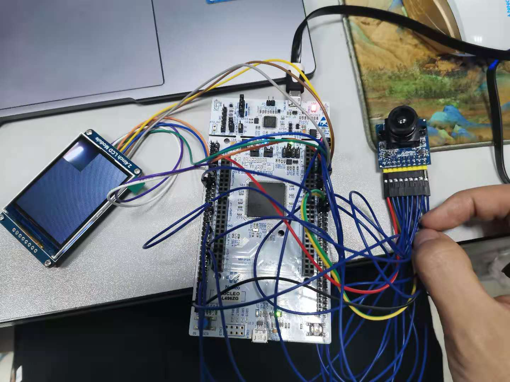
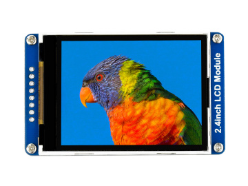
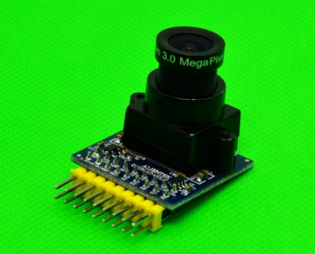
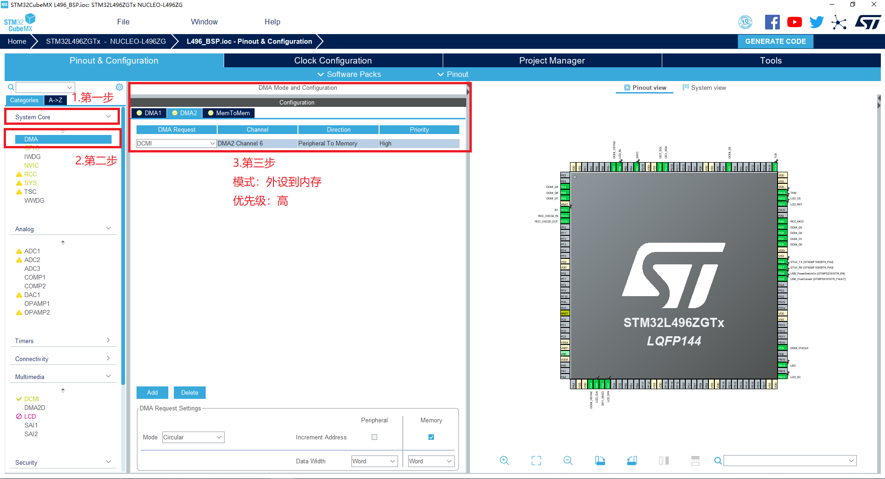
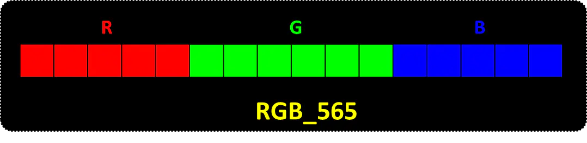
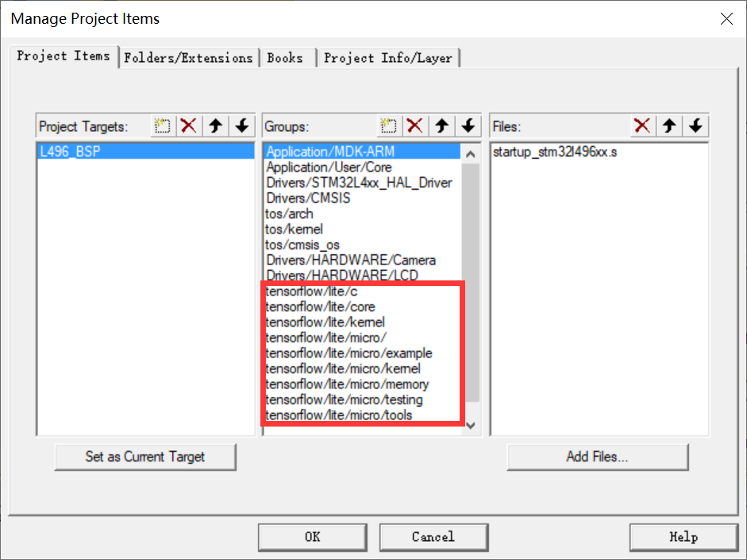
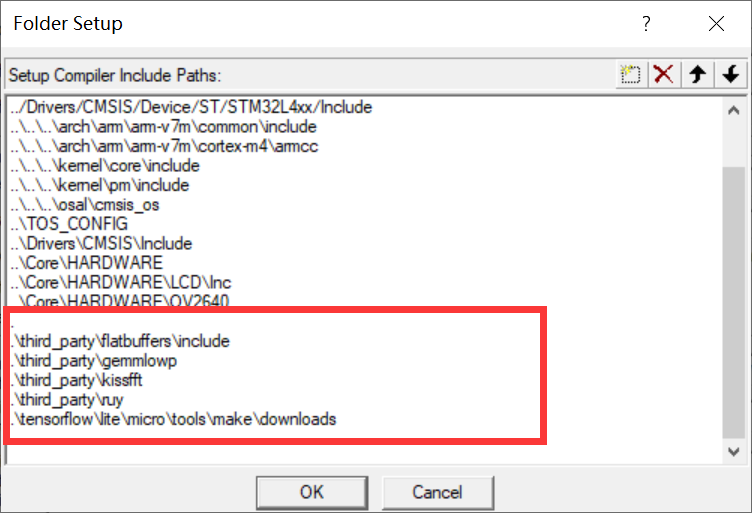
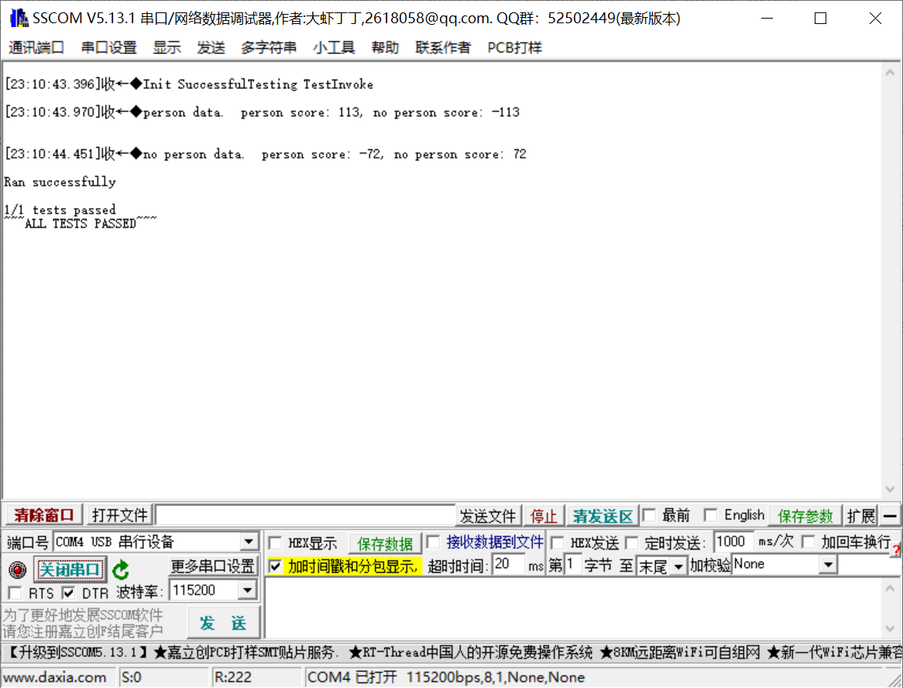

# 低功耗行人检测系统开发指南


## 0.选型依据
- 官方仓库操作系统+基础BSP（hello_world例程）占用为 44kb
- Tensorflow Lite Micro预计运行栈空间（1kb）+输入图像(9K) 10kb左右
- 图像输入缓存 18kb（96*96*2/1024）
- 预留TF Lite Micro框架的静态变量空间

由于TF Lite Micro实际运行状况未知，选择一块320kb SRAM的低功耗L系列MCU、系统时钟在30MHz（摄像头输入速度）以上较为稳妥，且必须要支持DCMI接口。
因此选择NUCLEO-L496ZG板卡作为尝试。


## 1. 基于NUCLEO-L496ZG移植

- tos基于keil的移植教程可以完全参考官网的步骤进行：
  https://github.com/Tencent/TencentOS-tiny/blob/master/doc/10.Porting_Manual_for_KEIL.md

- 使用ST官方的STM32CubeMX软件来自动化生成MCU外设配置的代码。

<div align=center>

</div>

对stm32L496的外设引脚分配如下：

### 2.4寸LCD屏

- VCC  &rarr;  3.3v
- GND &rarr; GND
- DIN &rarr; PA7(SPI1_MOSI)
- CLK &rarr; PA5(SPI1_CLK)
-  CS &rarr; PA12
- DC &rarr; PB12
- RST &rarr; PA11
- BL &rarr; PB6(TIM_CH1)

### OV2640摄像头模块

- VCC &rarr; 3.3v
- GND &rarr; GND
- VSYNC &rarr; PB7(DCMI_VSYNC)
- HSYNC &rarr; PA4(DCMI_HSYNC)
- PCLK &rarr; PD9(DCMI_PIXCLK)
- SCL &rarr; PB4
- SDA &rarr; PB5
- RESET &rarr; PB13
- PWDN &rarr; PB15
- D0 &rarr; PC6(DCMI_D0)
- D1 &rarr; PC7(DCMI_D1)
- D2 &rarr; PC8(DCMI_D2)
- D3 &rarr; PC9(DCMI_D3)
- D4 &rarr; PE4(DCMI_D4)
- D5 &rarr; PD3(DCMI_D5)
- D6 &rarr; PE5(DCMI_D6)
- D7 &rarr; PE6(DCMI_D7)

### 板载LED

- LED_Red &rarr; PB14

### 其它外设

- 温湿度传感器
- 陀螺仪等


## 2. 2.4寸LCD驱动移植

### 2.1硬件准备

<div align=center>

</div>

微雪电子2.4英寸TFT显示屏模块，分辨率为 240*320，使用 SPI 接口通信，LCD 内部控制芯片为IL9341。

### 2.2初始化SPI

使用Stm32CubeMX初始化SPI1：

<div align=center>

</div>

### 2.3 复制驱动代码

添加**LCD_2inch4.c**和**DEV_Config.c**，包含头文件**LCD_2inch4.h**和**DEV_Config.h**。

<div align=center>

</div>


增加include路径

<div align=center>

</div>


在**DEV_Config.h**定义相应的引脚：

<div align=center>

</div>

### 2.4重写LCD_2IN4_Display函数

在**LCD_2inch4.c**添加如下函数定义，并在**LCD_2inch4.h**添加函数声明：

```c
void LCD_2IN4_Display(UWORD *image,int width, int height)
{
  UWORD i,j;
	
	if(width > LCD_2IN4_WIDTH || height > LCD_2IN4_HEIGHT){
		printf("Picture size out of range!\n");
		return;
	}
	
  LCD_2IN4_SetWindow(0, 0, width, height);
	DEV_Digital_Write(DEV_DC_PIN, 1);
	for(i = 0; i < width; i++){
		for(j = 0; j < height; j++){
			LCD_2IN4_WriteData_Word(*(image+i*height+j));
		}
	 }
}
```

后续直接调用该函数，显示RGB565图像，方便摄像头调试。

## 3. OV2640摄像头驱动开发



### 纳秒级系统延时

需添加delay_us和delay_ms以产生摄像头配置需要的时序间隔，借助stm32底层的SysTick，具体实现在delay.c：

```c
void delay_us(uint32_t time_us) {
  uint32_t clk = 80;               // CPU 80MHz
  uint32_t ticks = time_us * clk;  // time is us
  uint32_t told = SysTick->VAL;
  uint32_t tnow = told;
  uint32_t tcnt = 0;
  for(; tcnt<ticks; tnow=SysTick->VAL)
  {
    if(tnow != told) {
      if(tnow < told) {
        tcnt += told - tnow;
      } else { 
        tcnt += SysTick->LOAD-tnow + told;
      } told = tnow;
    }
  }
}
```

### SCCB总线实现

使用PB4（SCL）和PB5(SDA)模拟软件I2C协议，向摄像头发送或接收信号，具体实现在sccb.c，其中包含以下几个函数：

```c
#define SCCB_SDA_IN()  {GPIOB->MODER&=~(3<<(5*2));GPIOB->MODER|=0<<5*2;}	//设置PB5为输入
#define SCCB_SDA_OUT() {GPIOB->MODER&=~(3<<(5*2));GPIOB->MODER|=1<<5*2;} 	//设置PB5为输出
#define SCCB_ID   			0X60  											//OV2640的ID号
void SCCB_Init(void);			//初始化GPIO
void SCCB_Start(void);			//时钟线为高时，数据线由高拉到低，为SCCB起始信号
void SCCB_Stop(void);			//时钟先为低时，数据线由低拉到高，为SCCB停止信号
void SCCB_No_Ack(void);			//产生NA信号
u8 SCCB_WR_Byte(u8 dat);		//SCCB写入一个字节
u8 SCCB_RD_Byte(void);			//SCCB读取一个字节
u8 SCCB_WR_Reg(u8 reg,u8 data);	//将一个值写入一个寄存器
u8 SCCB_RD_Reg(u8 reg);			//从一个寄存器中读出一个值
void SCCB_SCL(u8 sccb_scl);		//将时钟线设置为高或低（IO为输出模式）
void SCCB_SDA(u8 sccb_sda);		//将数据线设置为高或低（IO为输出模式）
u8 SCCB_READ_SDA(void);			//读取数据线上的值（IO为输入模式）
```

### OV2640摄像头配置

需通过配置寄存器，依次完成摄像头的初始化、RGB565模式设置、输出图像分辨率设置、图像颜色设置，具体实现在ov2640.c：

```c
void OV2640_Init(void);										//执行上电复位操作，并读取厂家ID验证
void OV2640_RGB565_Mode(void);								//设置像素格式为RGB565
void OV2640_OutSize_Set(uint16_t width,uint16_t height);	//设置输入为96*96大小的彩图
void OV2640_Special_Effects(uint8_t eft);					//eft设置为0，表示默认普通模式
```

### DCMI接口配置

**DCMI配置：**

<div align=center>

</div>

<div align=center>

</div>


**DMA配置：**

<div align=center>

</div>


**在main函数重写DCMI帧中断回调函数：**

```c
/* USER CODE BEGIN 4 */
void HAL_DCMI_FrameEventCallback(DCMI_HandleTypeDef *hdcmi)
{
	if(hdcmi->State == 2 && frame_flag != 1){
		frame_flag = 1; 
	}
}
/* USER CODE END 4 */
```


## 4. 图像预处理

<div align=center>

</div>

为完成摄像头输入彩图到模型输入需要的灰度图转换，需从输入的RGB565像素格式中解析出R、G、B三通道的值，再根据心理学公式计算出单个像素点的灰度：

```c
uint8_t RGB565toGRAY(uint16_t bg_color)	//输入RGB565像素点，返回灰度值
{
    uint8_t bg_r = 0;
    uint8_t bg_g = 0;
    uint8_t bg_b = 0;
    bg_r = ((bg_color>>11)&0xff)<<3;								//提取R通道的值
    bg_g = ((bg_color>>5)&0x3f)<<2;									//提取G通道的值
    bg_b = (bg_color&0x1f)<<2;										//提取B通道的值
    uint8_t gray = (bg_r*299 + bg_g*587 + bg_b*114 + 500) / 1000;	//心理学公式计算灰度
    return gray;
}
void Input_Convert(uint16_t* camera_buffer , uint8_t* model_buffer)	
{
	for(int i=0 ; i<OV2640_PIXEL_WIDTH*OV2640_PIXEL_HEIGHT ; i++) 	//遍历所有像素点
	{
		model_buffer[i] = RGB565toGRAY(camera_buffer[i]);		//单个像素点的RGB转换为灰度值
	}
	printf("one picture convert over\n");
}
```

## 5. Tensorflow Lite Micro移植

### 1.获取源代码

由于tensoroflow官方的源码的迭代速度较快, 所以不建议直接clone最新的官方源码, 而是直接应用某一固定版本的源码，在此基础之上，我们需要解决如何将Tensorflow lite Micro的有关代码从主体仓库中剥离出来。

在Tensorflow主仓库的根目录下输入（这一步需要在Linux系统下进行）：

```
make -f tensorflow/lite/micro/tools/make/Makefile generate_projects
```

命令的输出结果是若干基于Tensorflow Lite Micro的独立工程项目文件夹。

此处我们需要应用的案例是Tensorflow Lite Micro的person detection test工程, 所以从以下目录中获得

```
tensorflow/lite/micro/tools/make/gen/linux_x86_64/prj/person_detection_test_int8/keil
```

其中提供了一个完整的Tensorflow Lite Micro的Keil工程, 但是没提供任何板卡方面的支持.

### 2.将TFLite Micro加入Keil工程

将该文件下的tensorflow文件夹和third_party文件夹移动到STM32L496的工程目录下, 此处放在了`board\NUCLEO_L496ZG\MDK-ARM`文件夹下，然后将其加入工程目录：

<div align=center>

</div>

如图示红框位置所示，其中以tensorflow开头的文件夹是与tensorflow框架有关的源文件；同时每个文件夹下的源文件基本就是tensorflow Lite Micro中每个文件夹下包含的源文件。值得注意的是，由于本历程中TensorFlow Lite Micro应用了CMSIS-NN对算子进行了加速，所以`tensorflow/lite/micro/tools`中主要存放与CMSIS-NN有关的源文件。

增加include路径：

<div align=center>

</div>

图示红框位置即为需要增加的include路径。

具体每个文件夹中的源文件可以具体参考工程目录，值得注意的是，`tensorflow/lite/micro/kernel`目录中的`add.cc`, `conv.cc`, `depthwise.cc`, `full_connected.cc`, `mul.cc`, `pooling.cc`, `softmax.cc`源文件是采用的基于CMSIS-NN优化后的算子，而并没有应用Tensorflow Lite Micro自带的reference算子，在添加有关源文件是需要注意。

### 3. 将TFLiteMicro移植到Tencent OS-tiny系统中

在TensorFlow Lite Micro的移植过程中，首先需要实现`debug_log.cc`中的`void DebugLog(const char *s)`函数，用于打印当前TensorFlow Lite Micro运行信息。

由于Tencent OS  Tiny的Nucleo STM32L496 BSP中的MDK开发环境提供的`printf`函数主要是基于Keil的microlib库，但是microlib库不支持C++的全局变量，编译时会报错，所以需要解决在不依赖microlib的情况下实现系统的`printf`打印功能。

在实现过程中我们发现，`printf`可以通过对`stdio.h`中的`printf`函数进行重定向来实现；但是由于取消了Microlib库，Keil在编译的过程中会使用semihosting SWI完成sys_io，使得系统在非调试状态下无法运行，需要手动关闭半主机模式，并实现一个retarget.c来禁止semihosting。

同时由于TensorFlow Lite Micro的实现过程中包含了complex template, 其重写了"<<"和">>"运算符，需要实现所有的sys_io，即完整版的retarget.c文件来保证整个工程的顺利编译链接。根据Keil提供的官方模板，我们最终完成了TensorFlow Lite Micro针对Tencent OS tiny的移植，retarget.c函数中的具体内容可以参考源码。

### 4. 应用TFLite Micro自带测试框架完成行人检测模型测试

在成功移植之后，接下来需要检测系统是否正常运行，这里我们直接选用完整的uint8 行人检测模型来进行系统测试，在经过上述的移植过程之后，整个TensorFlow Lite Micro系统就可以完整编译并成功烧录。由于TensorFlow Lite Micro中内置了一个轻量级测试框架，需要在其中加入有关的板级初始化内容，`micro_test.h`中在添加以下代码：

```
#define TF_LITE_MICRO_TESTS_BEGIN              \
  namespace micro_test {                       \
  int tests_passed;                            \
  int tests_failed;                            \
  bool is_test_complete;                       \
  bool did_test_fail;                          \
  tflite::ErrorReporter* reporter;             \
  }                                            \
                                               \
  int main(void) {            				   \
    micro_test::tests_passed = 0;              \
    micro_test::tests_failed = 0;              \
    tflite::MicroErrorReporter error_reporter; \
    micro_test::reporter = &error_reporter;	   \
	HAL_Init();								   \
	SystemClock_Config();                      \
	board_init();					           \
	printf("Init Successful");
```

```
#define TF_LITE_MICRO_TESTS_END                                \
  micro_test::reporter->Report(                                \
      "%d/%d tests passed", micro_test::tests_passed,          \
      (micro_test::tests_failed + micro_test::tests_passed));  \
  if (micro_test::tests_failed == 0) {                         \
    micro_test::reporter->Report("~~~ALL TESTS PASSED~~~\n");  \
  } else {                                                     \
    micro_test::reporter->Report("~~~SOME TESTS FAILED~~~\n"); \
  }                                                            \
	while(1);												   \
  }
```

整个系统可以顺利初始化并打印测试结果。

在系统成功运行之后，可以看到如下检测结果：

<div align=center>

</div>

## 6. 行人检测demo制作

demo的实现代码放在main.cc的Task1中，并分配了10240b的运行栈空间：

```c
void task1(void *pdata)
{
	int res = 0;	//行人检测结果判断，0为没有行人，1为有行人
    while(1)
    {
		if(frame_flag == 1)	//若中断中接收到一帧图像，标志位置1
		{
			if(HAL_DCMI_Stop(&hdcmi))	//停止图像传输
				Error_Handler();		
			Input_Convert(camBuffer , modelBuffer);	//图像预处理
			res = Person_Detect();	//调用行人检测的模型接口
			LCD_2IN4_Display(camBuffer,OV2640_PIXEL_WIDTH,OV2640_PIXEL_HEIGHT);	//lcd显示原图像
			if(HAL_DCMI_Start_DMA(&hdcmi, DCMI_MODE_CONTINUOUS,  (uint32_t)camBuffer , (OV2640_PIXEL_WIDTH*OV2640_PIXEL_HEIGHT)/2))	//开启图像传输
				Error_Handler();
			frame_flag = 0;//标志位恢复
			if(res != 0)
			{	//若检测到行人，则板载红色LED灯进行快速闪烁
				HAL_GPIO_WritePin(GPIOB, LED_Pin, GPIO_PIN_SET);
				delay_ms(50);
				HAL_GPIO_WritePin(GPIOB, LED_Pin, GPIO_PIN_RESET);
			}
		}
		osDelay(50);
    }
}
```
需要将image_provider.cc中GetImage函数的数据获取源修改为相机输入的buffer：
```c
TfLiteStatus GetImage(tflite::ErrorReporter* error_reporter, int image_width,
                      int image_height, int channels, int8_t* image_data) {
    for(int i=0 ; i<OV2640_PIXEL_WIDTH*OV2640_PIXEL_HEIGHT ; i++)
    {
        image_data[i] = RGB565toGRAY(camBuffer[i]);
    }
    return kTfLiteOk;
}
```
## 7.结果分析
实际SRAM占用为168K，Flash占用为314K
其中除开TF Lite Micro的其它内存占用为25K（os+camera+lcd）


