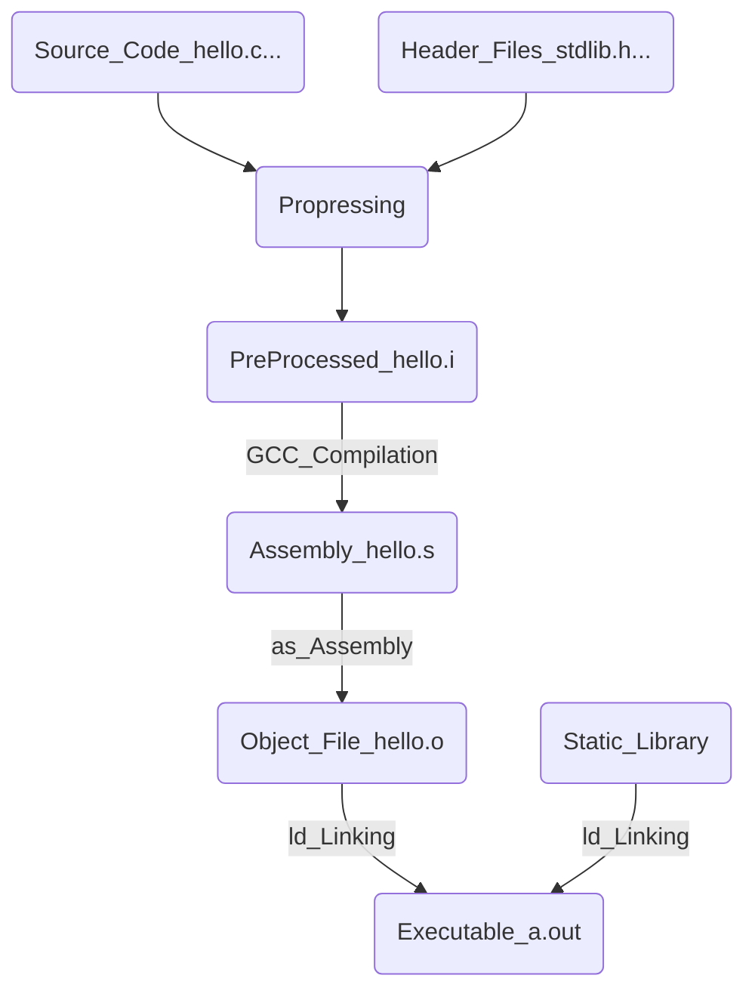

### GCC编译过程

1. ##### 编译器将C程序源码转变成汇编代码：

   1. 词法分析
   2. 语法分析
   3. 语义分析
   4. 中间代码生成
   5. 目标代码生成与优化

2. ##### 链接过程

   1. 为什么需要链接
   2. 重定位
   3. 符号
   4. 符号决议

3. ##### 目标文件

   1. 目标文件格式与组成

4. ##### 库

5. ##### 运行库