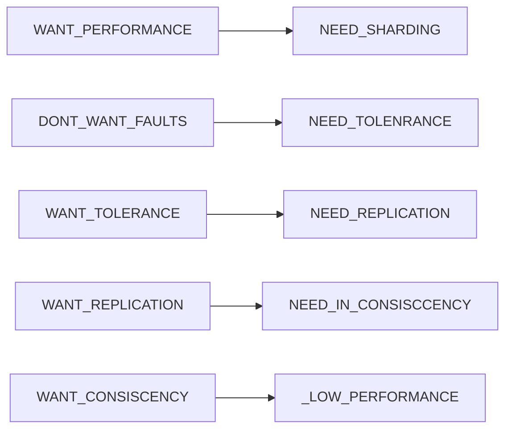
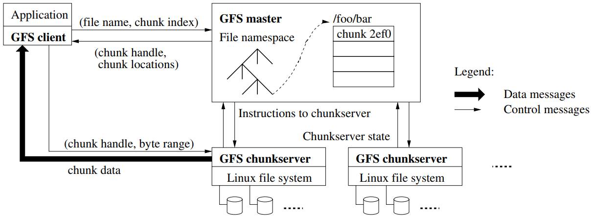

## MIT 6.824分布式系统

### Lecure 2 RPC and Threads

RPC ( Remote Procedure Call ): 远程过程调用，简单的理解就是，一个节点请求另一个节点提供服务

Cordination

这节课的总结：

### Lecure 3 GFS

#### 3.1  GFS Target:

- Big, Fast
- Global, Universal
- Sharding
- Automatic Rcovering

#### 3.2 Paper: *The Google File System* 

Topic：谷歌分布式文件系统

##### 3.2.1 GFS设计原则：

- 节点失效是常态
- 存储内容以大文件为主

##### 3.2.2 GFS集群架构：

##### 3.2.3 chunk大小：

##### 3.2.4 GFS元数据管理：

##### 3.2.5 Namespace管理：

##### 3.2.6 Chunk租约lease和变更顺序：

##### 3.2.7 GFS集群常见操作流程：

###### 3.2.7.1 文件写入：

###### 3.2.7.2文件追加：

###### 3.2.7.3 文件快照：

###### 3.2.7.4 文件读取：

#### 3.3 这节课的总结

### Lecure 4 Primary-Backup Replication

### Lecure 5 Go threads and Raft

### Lecure 6 Fault Tolerance Raft Part1

### Lecure 7 Fault Tolerance Raft Part2 

### Lecure 8 Zookeeper

### Lecure 9 More Replication CRAQ

### Lecure 10 Cloud Replication DB Aurora

### Lecure 11 Cache Consistency Frangipani

### Lecure 12  Distributed  Transaction

### Lecure 13 Spanner

### Lecure 14 Optimistic Concurrecny Control

### Lecure 15 Big Data Spark

### Lecure 16 Cache Consistence Memcached at Facebook

### Lecure 17 COPS Causal Consistency

### Lecure 18 Fork Consistency Certificate Transparency

### Lecure 19 Bitcoin

### Lecure 20 BlockStack