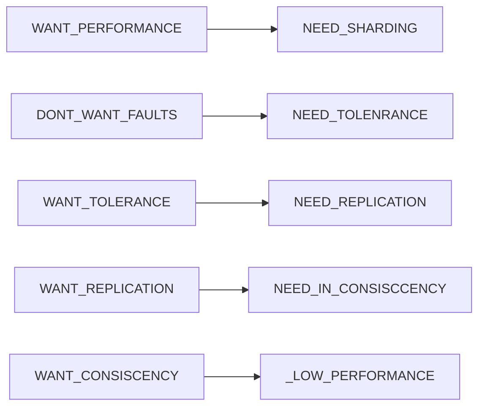

## MIT 6.824分布式系统

### Lecure 2 RPC and Threads

RPC ( Remote Procedure Call ): 远程过程调用，简单的理解就是，一个节点请求另一个节点提供服务

Cordination

这节课的总结：

### Lecure 3 GFS

#### 3.1  GFS Target:

- Big, Fast
- Global, Universal
- Sharding
- Automatic Rcovering

#### 3.2 Paper: *The Google File System* 

Topic：谷歌分布式文件系统

##### 3.2.1 GFS设计原则：

- 节点失效是常态
- 存储内容以大文件为主

##### 3.2.2 GFS集群架构：

##### 3.2.3 chunk大小：

##### 3.2.4 GFS元数据管理：

GFS元数据主要包括的信息：

- 文件和Chunk的命名空间
- 文件与Chunk的映射
- Chunk Replica的位置信息

元数据保存在Master内存中使得Master要对元数据作出变更变得极为容易；同时，这也使得Master可以简单高效地周期性扫描整个集群的状态，以实现Chunk回收、迁移、均衡等操作。唯一的不足在于这使得整个集群所能拥有的Chunk数量受限于Master的内存大小，然而实际中不必担心这种情况，因为一个64MB的Chunk，只需要保存64KB的元数据，况且提高Master内存容量的成本也很低。

Master会把前两类信息以日志形式持久化存储在Master的本地磁盘上，并在在其他机器上备份，但是不会持久化保存Chunk Replica的位置信息，而是在集群启动时由Master询问各个Chunk Server其当前所有的Repica。这样做可以省去由于Chunk Server离开集群、更改名字、重启等原因的Master与Chunk Server的同步问题。此后，Master通过心跳包来监控Chunk Server的状态并更新内存中的信息。

为了保证元数据的可用性，Master在对元数据做任何操作前对会用先写日志的形式将操作进行记录，只有当日志写入完成后才会响应客户端的请求，而这些日志也会备份到多个机器上。日志不仅是元数据的唯一持久化记录，也是定义操作执行顺序的时间线。文件、Chunk和他们的版本信息都由他们的创建时间唯一的永久的标识。

##### 3.2.5 Namespace管理：

##### 3.2.6 Chunk租约lease和变更顺序：

##### 3.2.7 GFS集群常见操作流程：

###### 3.2.7.1 文件写入：

###### 3.2.7.2文件追加：

###### 3.2.7.3 文件快照：

###### 3.2.7.4 文件读取：

#### 3.3 这节课的总结

### Lecure 4 Primary-Backup Replication

### Lecure 5 Go threads and Raft

### Lecure 6 Fault Tolerance Raft Part1

### Lecure 7 Fault Tolerance Raft Part2 

### Lecure 8 Zookeeper

### Lecure 9 More Replication CRAQ

### Lecure 10 Cloud Replication DB Aurora

### Lecure 11 Cache Consistency Frangipani

### Lecure 12  Distributed  Transaction

### Lecure 13 Spanner

### Lecure 14 Optimistic Concurrecny Control

### Lecure 15 Big Data Spark

### Lecure 16 Cache Consistence Memcached at Facebook

### Lecure 17 COPS Causal Consistency

### Lecure 18 Fork Consistency Certificate Transparency

### Lecure 19 Bitcoin

### Lecure 20 BlockStack