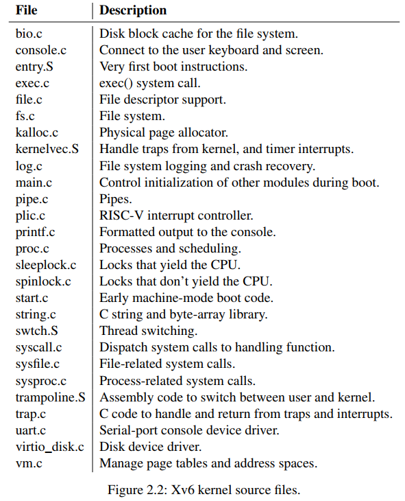

## MIT6.S081 & 6.828

### Lec1 介绍

------

#### 1.1 课程内容 

- OS Interface

- 为什么fork和exce要分开实现？

  因为....

Operating system organization，操作系统三大要求

- multiplexing
- isolation
- interaction

monolithic kerne 单内核

#### 1.2 Lab

##### 安装环境与编译系统

[Xv6 and Unix utilities]()

系统：ubuntu18.04-LTS

- step1 获取实验代码

```sh
$ git clone git://g.csail.mit.edu/xv6-labs-2020
Cloning into 'xv6-labs-2020'...
...
$ cd xv6-labs-2020
$ git checkout util
```

- step2 [安装tools](https://pdos.csail.mit.edu/6.828/2020/tools.html)

```shell
sudo apt-get install git build-essential gdb-multiarch qemu-system-misc gcc-riscv64-linux-gnu binutils-riscv64-linux-gnu 
```

`注意`交叉编译器的版本：ubuntu默认的gcc-7-riscv64-linux-gnu不支持-mno-relax选项，需要卸载gcc-7-riscv64-linux-gnu并安装gcc-8-riscv64-linux-gnu；然后创建链接/usr/bin/riscv64-linux-gnu-gcc指向/usr/bin/riscv64-linux-gnu-gcc-8

```shell
$ sudo apt-get install gcc-8-riscv64-linux-gnu
```

```shell
$ update-alternatives --install /usr/bin/riscv64-linux-gnu-gcc riscv64-linux-gnu-gcc /usr/bin/riscv64-linux-gnu-gcc-8 1
```

`注意` ubuntu apt安装的qemu版本太老，缺失qemu-system-riscv64

下载qemu并编译安装

```shell
$ wget https://download.qemu.org/qemu-5.1.0.tar.xz
$ tar xf qemu-5.1.0.tar.xz
```

```shell
$ cd qemu-5.1.0
$ ./configure --disable-kvm --disable-werror --prefix=/usr/local --target-list="riscv64-softmmu"
$ make
$ sudo make install
$ cd ..
```

编译过程有缺失依赖再另外google解决。

RSIC-V工具链安装[教程](https://www.cnblogs.com/zhayujie/p/12970935.html)

- step3 进入Lab code文件夹编译并启动xv6系统

```shell
# in the xv6 directory
$ make qemu
# ... lots of output ...
init: starting sh
$
```

To quit qemu type: `Ctrl-a x`

- 使用gdb调试xv6系统

make qemu-gdb

打开新的终端，进入相同目录，

执行 rsicv64-unknown-eif-gdb，

执行target remote : 端口号

##### 实现一个sleep程序

> Implement the UNIX program sleep for xv6; your sleep should pause for a user-specified number of ticks. A tick is a notion of time defined by the xv6 kernel, namely the time between two interrupts from the timer chip. Your solution should be in the file user/sleep.c. 

> Some hints:
>
> - Before you start coding, read Chapter 1 of the xv6 book.
> - Look at some of the other programs in user/ (e.g., user/echo.c, user/grep.c, and user/rm.c) to see how you can obtain the command-line arguments passed to a program.
> - If the user forgets to pass an argument, sleep should print an error message.
> - The command-line argument is passed as a string; you can convert it to an integer using atoi (see user/ulib.c).
> - Use the system call sleep.
> - See kernel/sysproc.c for the xv6 kernel code that implements the sleep system call (look for sys_sleep), user/user.h for the C definition of sleep callable from a user program, and user/usys.S for theassembler code that jumps from user code into the kernel for sleep.
> - Make sure main calls exit() in order to exit your program.
> - Add your sleep program to UPROGS in Makefile; once you've done that, make qemu will compile your program and you'll be able to run it from the xv6 shell.
> - Look at Kernighan and Ritchie's book The C programming language (second edition) (K&R) to learn about C. 

源码写在lab/user/sleep.c 

```c
/**
 * @file sleep.c
 * @author YangQingsheng
 * @brief Implement the UNIX program sleep for xv6
 * @version 0.1
 * @date 2021-02-08
 * 
 * @copyright Copyright (c) 2021
 * 
 */
#include "kernel/types.h"
#include "kernel/stat.h"
#include "user/user.h"

int main(int argc, char *argv[])
{
    int seconds;
    if(argc != 2){
        fprintf(2, "usage: sleep [seconds]\n");
        exit(1);
    }

    seconds = atoi(argv[1]);

    if(seconds < 0){
        fprintf(2, "sleep: parameter error\n");
        exit(1);
    }

    sleep(seconds);
    //fprintf(2, "sleep %d seconds done\n",seconds);

    exit(0);
}
```

在Makefile的UPROGS添加_sleep

执行`make grade` 测试代码

##### 实现一个pingpong程序

> Write a program that uses UNIX system calls to ''ping-pong'' a byte between two processes over a pair of pipes, one for each direction. The parent should send a byte to the child; the child should print "<pid>: received ping", where <pid> is its process ID, write the byte on the pipe to the parent, and exit; the parent should read the byte from the child, print "<pid>: received pong", and exit. Your solution should be in the file user/pingpong.c.
>

> Some hints:
>
> - Use pipe to create a pipe.
> - Use fork to create a child.
> - Use read to read from the pipe, and write to write to the pipe.
> - Use getpid to find the process ID of the calling process.
> - Add the program to UPROGS in Makefile.
> - User programs on xv6 have a limited set of library functions available to them. You can see the list in user/user.h; the source (other than for system calls) is in user/ulib.c, user/printf.c, and user/umalloc.c. 

思路，两个管道，父进程通过管道1发送，子进程接收到内容后，通过管道2发送，父进程接收

源码

```c
#include "kernel/types.h"
#include "user/user.h"

int main(int argc, char *argv[])
{
    int pipe1_p2c[2],pipe2_c2p[2];//two pipe, pipe[0]:read, pipe[1]:wirte
    char buffer[] = {'Y'};
    long length = sizeof(buffer);
    pipe(pipe1_p2c);   
    pipe(pipe2_c2p);


    if(fork() == 0){ //child
        close(pipe1_p2c[1]);
        close(pipe2_c2p[0]);

        if(read(pipe1_p2c[0],buffer,length) != length){
            printf("parent--pipe-->child error\n");
            exit(1);
        }

        printf("%d: received ping\n",getpid());

        if(write(pipe2_c2p[1],buffer,length) != length){
            printf("child--piepe-->parent error\n");
            exit(1);
        }
        exit(0);
    }
    
    //parent
    close(pipe1_p2c[0]);
    close(pipe2_c2p[1]);

    if(write(pipe1_p2c[1],buffer,length) != length){
        printf("parent--pipe-->child error\n");
        exit(1);
    }

    if(read(pipe2_c2p[0], buffer, length) != length){
        printf("child--pipe-->parent error\n");
        exit(1);
    }

    printf("%d: received pong\n",getpid());

    exit(0);
}

```

执行测试

```bash
$./grade-lab-util pingpong
```


##### 利用管道与多进程打印质数

参考资料：[CSP Threads](https://swtch.com/~rsc/thread/) ，[CSDN](https://blog.csdn.net/zhayujie5200/article/details/106600925?utm_medium=distribute.pc_relevant.none-task-blog-baidujs_title-2&spm=1001.2101.3001.4242)

primes的功能是输出2~35之间的素数，实现方式是递归fork进程并使用管道链接，形成一条pipeline来对素数进行过滤。

每个进程收到的第一个数p一定是素数，后续的数如果能被p整除则之间丢弃，如果不能则输出到下一个进程，详细介绍可参考文档。伪代码如下：

```c
void primes() {
  p = read from left   // 从左边接收到的第一个数一定是素数
  if (fork() == 0): 
    primes()           // 子进程，进入递归
  else: 
    loop: 
      n = read from left  // 父进程，循环接收左边的输入  
      if (p % n != 0): 
        write n to right  // 不能被p整除则向右输出   
}
```

<div align=center>
    
</div>


还需要注意两点：

- 文件描述符溢出： xv6限制fd的范围为0~15，而每次pipe()都会创建两个新的fd，如果不及时关闭不需要的fd，会导致文件描述符资源用尽。这里使用重定向到标准I/O的方式来避免生成新的fd，首先close()关闭标准I/O的fd，然后使用dup()复制所需的管道fd（会自动复制到序号最小的fd，即关闭的标准I/O），随后对pipe两侧fd进行关闭（此时只会移除描述符，不会关闭实际的file对象）。

- pipeline关闭： 在完成素数输出后，需要依次退出pipeline上的所有进程。在退出父进程前关闭其标准输入fd，此时read()将读取到eof（值为0），此时同样关闭子进程的标准输入fd，退出进程，这样进程链上的所有进程就可以退出。

源码

```c++
#include "kernel/types.h"
#include "user/user.h"

void func(int *input, int length){
    if(length == 1){             //递归基
        printf("prime %d\n",*input);
        return;
    }

    int p[2];
    int prime = *input;
    int temp;

    printf("prime %d\n",*input);//管道左侧（先进先出）第一个值一定是prime number
    pipe(p);
    
    int i;
    if(fork() == 0){            //子进程
        for(i = 0; i < length; ++i){
            temp = *(input + i);
            write(p[1], (char*)(&temp), 4);//往管道写入数据
        }
        exit(0);
    }
    close(p[1]); //重要

    if(fork() == 0){           //子进程
        int temp_length = 0;
        char temp_buffer[4];
        int temp_value;
        while(read(p[0],temp_buffer,4) != 0){ //读取管道数据
            temp_value = *((int *)temp_buffer);
            if(temp_value % prime != 0){      //不能被当前质数整除继续
                *input = temp_value;          //按顺序写入数组，覆盖原来的数据
                input += 1;
                temp_length ++;
            }//操作完成后，能被当前的质数整除的数字被抛弃，数据长度变短
        }
        func(input - temp_length, temp_length);//由于使用的是指针，将指针回退到数组首地址，递归
        exit(0);
    }

	wait(0);
	wait(0);
}

int main(){
    int input[34];
	int i = 0;
	for(; i < 34; i++){
		input[i] = i+2;
	}
	func(input, 34);
    exit(0);
}

```

```bash
xv6 kernel is booting

hart 1 starting
hart 2 starting
init: starting sh
$ primes
prime 2
prime 3
prime 5
prime 7
prime 11
prime 13
prime 17
prime 19
prime 23
prime 29
prime 31
$ QEMU: Terminated
root@ubuntu:~/Myfile/mitos/xv6-labs-2020# ./grade-lab-util primes
make: 'kernel/kernel' is up to date.
== Test primes == primes: OK (1.5s) 
    (Old xv6.out.primes failure log removed)
```


##### find

> Write a simple version of the UNIX find program: find all the files in a directory tree with a specific name. Your solution should be in the file user/find.c. 

```c
#include "kernel/types.h"
#include "kernel/fcntl.h"
#include "kernel/stat.h"
#include "kernel/fs.h"
#include "user/user.h"

char* fmt_name(char *path){
    static char buf[DIRSIZ+1];
    char *p;

    for(p = path + strlen(path); p >= path && *p != '/'; p--);
    p++;
    memmove(buf, p, strlen(p)+1);
    return buf;
}


void eq_print(char *fileName, char *findName){
    if(strcmp(fmt_name(fileName), findName) == 0){
        printf("%s\n", fileName);
    }
}

void find(char *path, char *findName){
    int fd;
    struct stat st;
    if((fd = open(path, O_RDONLY)) < 0){
        fprintf(2, "find: cannot open %s\n", path);
        return;
    }

    if(fstat(fd, &st) < 0){
        fprintf(2, "find: connot stat %s\n", path);
        close(fd);
        return;
    }
    char buf[512],*p;
    struct dirent de;
    switch(st.type){
        case T_FILE:
            eq_print(path, findName);
            break;
        case T_DIR:
            if( strlen(path) + 1 + DIRSIZ + 1 > sizeof(buf)){
                printf("find: path too long\n");
                break;               
            }
            strcpy(buf, path);
            p = buf + strlen(buf);
            *p++ = '/';
            while( read(fd, &de, sizeof(de)) == sizeof(de) ){
                //printf("de.name: %s. de.inum: %d\n", de.name, de.inum);
                if(de.inum == 0 || de.inum == 1 || strcmp(de.name, ".")==0)
                    continue;
                memmove(p, de.name, strlen(de.name));
                p[strlen(de.name)] = 0;
                find(buf, findName);
            }
            break;

    }
    close(fd);
}


int main(int argc, char *argv[]){
    if(argc < 3){
        printf("find: find <[path]> <fileName>\n");
        exit(0);
    }
    find(argv[1], argv[2]);
    exit(0);
}
```

##### xargs

```c
#include "kernel/types.h"
#include "user/user.h"

int main(int argc, char *argv[]){
    int i;
    int j = 0;
    int k;
    int l,m = 0;
    char block[32];
    char buf[32];
    char *p = buf;
    char *lineSplit[32];
    for(i = 1; i < argc; i++){
        lineSplit[j++] = argv[i];
    }
    while( (k = read(0, block, sizeof(block))) > 0){
        for(l = 0; l < k; l++){
            if(block[l] == '\n'){
                buf[m] = 0;
                m = 0;
                lineSplit[j++] = p;
                p = buf;
                lineSplit[j] = 0;
                j = argc - 1;
                if(fork() == 0){
                    exec(argv[1], lineSplit);
                }                
                wait(0);
            }else if(block[l] == ' ') {
                buf[m++] = 0;
                lineSplit[j++] = p;
                p = &buf[m];
            }else {
                buf[m++] = block[l];
            }
        }
    }
    exit(0);
}

```


### Lec2 C & GDB

------

#### 2.1 Lab

##### Systemcall

> In this assignment you will add a system call tracing feature that may help you when debugging later labs. You'll create a new trace system call that will control tracing. It should take one argument, an integer "mask", whose bits specify which system calls to trace. For example, to trace the fork system call, a program calls trace(1 << SYS_fork), where SYS_fork is a syscall number from `kernel/syscall.h`. You have to modify the xv6 kernel to print out a line when each system call is about to return, if the system call's number is set in the mask. The line should contain the process id, the name of the system call and the return value; you don't need to print the system call arguments. The trace system call should enable tracing for the process that calls it and any children that it subsequently forks, but should not affect other processes. 
>

实验前准备：

Before you start coding, read Chapter 2 of the [xv6 book](https://pdos.csail.mit.edu/6.828/2020/xv6/book-riscv-rev1.pdf), and Sections 4.3 and 4.4 of Chapter 4, and related source files:

- The user-space code for systems calls is in `user/user.h` and `user/usys.pl`.
- The kernel-space code is `kernel/syscall.h`, kernel/syscall.c.
- The process-related code is `kernel/proc.h` and `kernel/proc.c`.

实验目的，增加一个trace系统调用，可以用来跟踪某个系统调用被执行的情况，此函数入参为一个数字，可以控制跟踪哪些system call。

- trace(1<<SYS_fork)，trace(10b)，
- trace(2)表示跟踪fork调用；trace(1<<SYS_read)，
- trace(10 0000b)，trace(32)，表示跟踪read调用；
- trace(10 0010b)，trace(34)，表示跟踪fork、read调用；
- 达到的效果：trace 32 grep hello README，表示执行grep hello README时，read system call调用时，进行打印
  

We provide a `trace` user-level program that runs another program with tracing enabled (see `user/trace.c`). When you're done, you should see output like this:

```
$ trace 32 grep hello README
3: syscall read -> 1023
3: syscall read -> 966
3: syscall read -> 70
3: syscall read -> 0
$
$ trace 2147483647 grep hello README
4: syscall trace -> 0
4: syscall exec -> 3
4: syscall open -> 3
4: syscall read -> 1023
4: syscall read -> 966
4: syscall read -> 70
4: syscall read -> 0
4: syscall close -> 0
$
$ grep hello README
$
$ trace 2 usertests forkforkfork
usertests starting
test forkforkfork: 407: syscall fork -> 408
408: syscall fork -> 409
409: syscall fork -> 410
410: syscall fork -> 411
409: syscall fork -> 412
410: syscall fork -> 413
409: syscall fork -> 414
411: syscall fork -> 415
...
$   
```

In the first example above, trace invokes grep tracing just the read system call. The 32 is `1<<SYS_read`. In the second example, trace runs grep while tracing all system calls; the 2147583647 has all 31 low bits set. In the third example, the program isn't traced, so no trace output is printed. In the fourth example, the fork system calls of all the descendants of the `forkforkfork` test in `usertests` are being traced. Your solution is correct if your program behaves as shown above (though the process IDs may be different).

一些提示

Some hints:

- Add `$U/_trace` to UPROGS in Makefile
- Run make qemu and you will see that the compiler cannot compile `user/trace.c`, because the user-space stubs for the system call don't exist yet: add a prototype for the system call to `user/user.h`, a stub to `user/usys.pl`, and a syscall number to `kernel/syscall.h`. The Makefile invokes the perl script `user/usys.pl`, which produces `user/usys.S`, the actual system call stubs, which use the RISC-V `ecall` instruction to transition to the kernel. Once you fix the compilation issues, run trace 32 grep hello README; it will fail because you haven't implemented the system call in the kernel yet.
- Add a `sys_trace()` function in `kernel/sysproc.c` that implements the new system call by remembering its argument in a new variable in the `proc` structure (see `kernel/proc.h`). The functions to retrieve system call arguments from user space are in `kernel/syscall.c`, and you can see examples of their use in `kernel/sysproc.c`.
- Modify `fork()` (see `kernel/proc.c`) to copy the trace mask from the parent to the child process.
- Modify the `syscall()` function in `kernel/syscall.c` to print the trace output. You will need to add an array of syscall names to index into.

具体实现：

- 在kernel/syscall.h中宏定义 #define SYS_trace 22
- 修改user/usys.pl中新增一个entry
- 在user/user.h中新增trace函数声明


### Lec3 OS组织和系统调用

------

#### Abstracting physical resources

- 对物硬件资源进行抽象，方便用户使用
- 隔离硬件资源，保护内核，进程间也实现隔离

#### 用户模式，特权模式，和系统调用

> RISC-V has three modes in which the CPU can execute instructions: **machine mode, supervisor mode, and user mode**  
>
> In supervisor mode the CPU is allowed to execute privileged instructions: for example, enabling and disabling interrupts, reading and writing the register that holds the address of a page table, etc.  
>
> The software running in kernel space (or in supervisor mode) is called the kernel.

- 系统调用是用户代码与内核交互的接口（内核通过系统调用的方式对外提供服务）

#### 内核组织

操作系统的哪部分应该运行在supervisor mode？

- 所有系统调用都运行在supervisor mode：monolithic kernel 宏内核
  - 优：方便管理权限（不用区分）
  - 优：os的不同部分更容易协作
  - 缺：os复杂，开发容易出错，且错误致命
- 尽可能少的os代码运行在supervisor mode：microkernel 微内核
  - 优：kerlnel简单
  - 缺：不同的servcie之间通信代价大，难以实现高性能

#### xv6组织结构

<div align=center>
    
</div>

<div align=center>
    
</div>

限制process的地址空间的因素有哪些？

- RISC-V是64bit位宽，只使用了38或39bits，2^38 - 1 = 0x3f ffff ffff
- 地址空间顶部是tramponline和trapframe


> A process can make a system call by executing the RISC-V ecall instruction. This instruction raises the hardware privilege level and changes the program counter to a kernel-defined entry point.

- kernel/proc.h 


#### Code：starting xv6 and the first process

- kernel/entry.S：bootloader（以只读模式保存在内存）以machine mode加载内核代码，执行 _entry，xv6从这里开始启动
- loaders加载xv6内核代码到物理地址0x8000 0000
  - 为什么不是从0x0地址开始？
  - 因为0x0 : 0x8000 0000包含了I/O设备 
- _entry函数设置stack，xv6开始执行C代码

> The instructions at `_entry` set up a stack so that xv6 can run C code. Xv6 declares space for an initial stack, stack0, in the file start.c (kernel/start.c:11). The code at _entry loads the stack pointer register sp with the address stack0+4096, the top of the stack, because the stack on RISC-V grows down. Now that the kernel has a stack,       _entry calls into C code at start (kernel/start.c:21)

- RISC-V的mret指令：进入supervisor mode

- start函数：
  - 执行一些只在machine mode下才允许的操作configuration

> The function `start` performs some configuration that is only allowed in machine mode, and then switches to supervisor mode. To enter supervisor mode, RISC-V provides the instruction mret. This instruction is most often used to return from a previous call from supervisor mode to machine mode. start isn’t returning from such a call, and instead sets things up as if there had been one: it sets the previous privilege mode to supervisor in the register mstatus, it sets the return address to main by writing main’s address into the register mepc, disables virtual address translation in supervisor mode by writing 0 into the page-table register satp, and delegates all interrupts and exceptions to supervisor mode.
>
> Before jumping into supervisor mode, start performs one more task: it programs the clock chip to generate timer interrupts. With this housekeeping out of the way, start “returns” to supervisor mode by calling mret. This causes the program counter to change to main (kernel/main.c:11)  

- main
  - 初始化外设、子系统，创建第一个进程userinit ( kernel/proc.c )
  - userinit调用系统调用exec，启动init进程，创建文件描述符0，1，2，启动shell进程

> After main (kernel/main.c:11) initializes several devices and subsystems, it creates the first process by calling userinit (kernel/proc.c:212). The first process executes a small program written in RISC-V assembly, initcode.S (user/initcode.S:1), which re-enters the kernel by invoking the exec system call. As we saw in Chapter 1, exec replaces the memory and registers of the current process with a new program (in this case, /init). Once the kernel has completed exec, it returns to user space in the /init process. Init (user/init.c:15) creates a new console device file if needed and then opens it as file descriptors 0, 1, and 2. Then it starts a shell on the console. The system is up.

#### Real World

- 宏内核：Linux（许多Unix-like OS也是）
- 微内核：L4，Minix，QNX，（以微内核+servers方式，嵌入式领域居多）

> Most operating systems have adopted the process concept, and most processes look similar to xv6’s. Modern operating systems, however, support several threads within a process, to allow a single process to exploit multiple CPUs. Supporting multiple threads in a process involves quite a bit of machinery that xv6 doesn’t have, including potential interface changes (e.g., Linux’s clone, a variant of fork), to control which aspects of a process threads share.  


### Lec4 页表

------

